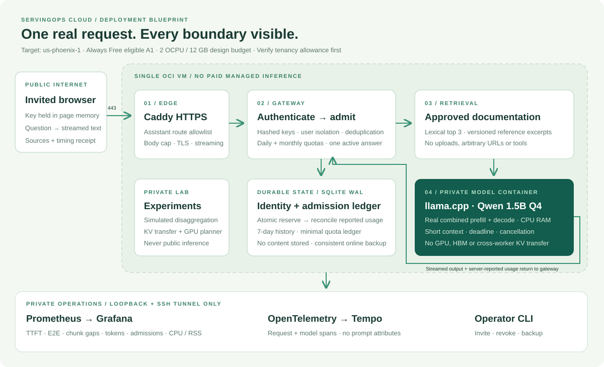
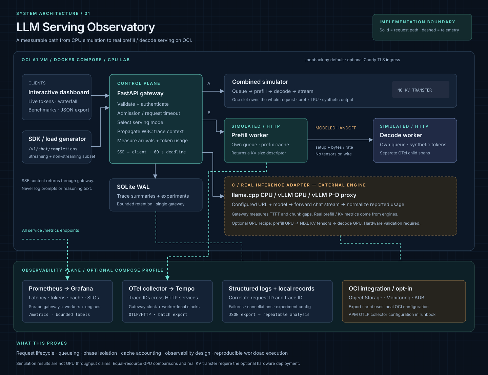
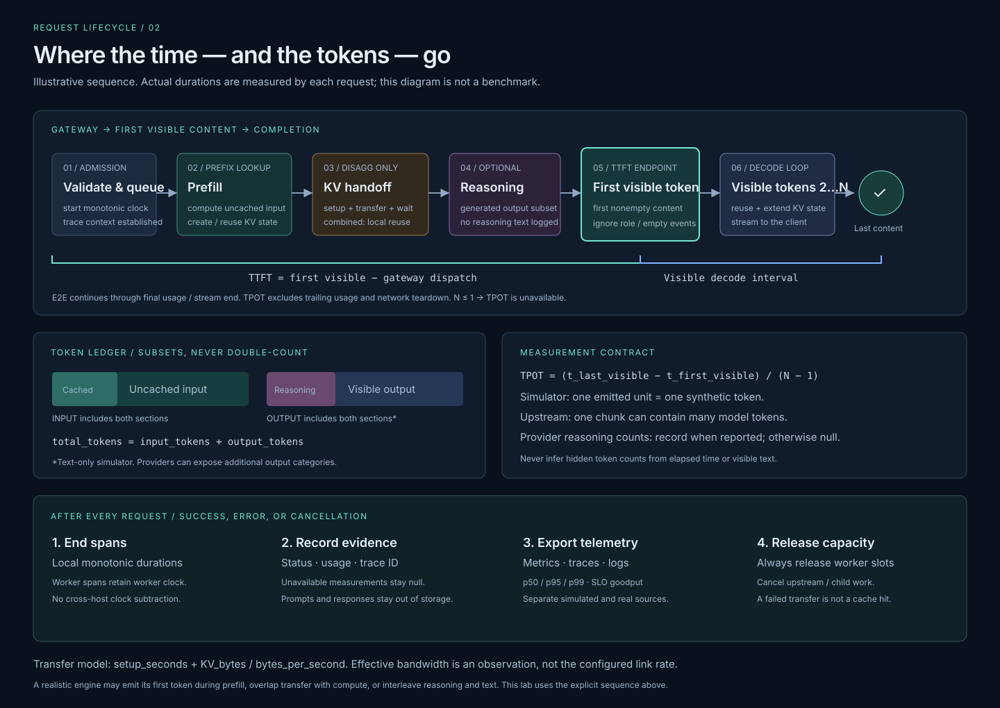
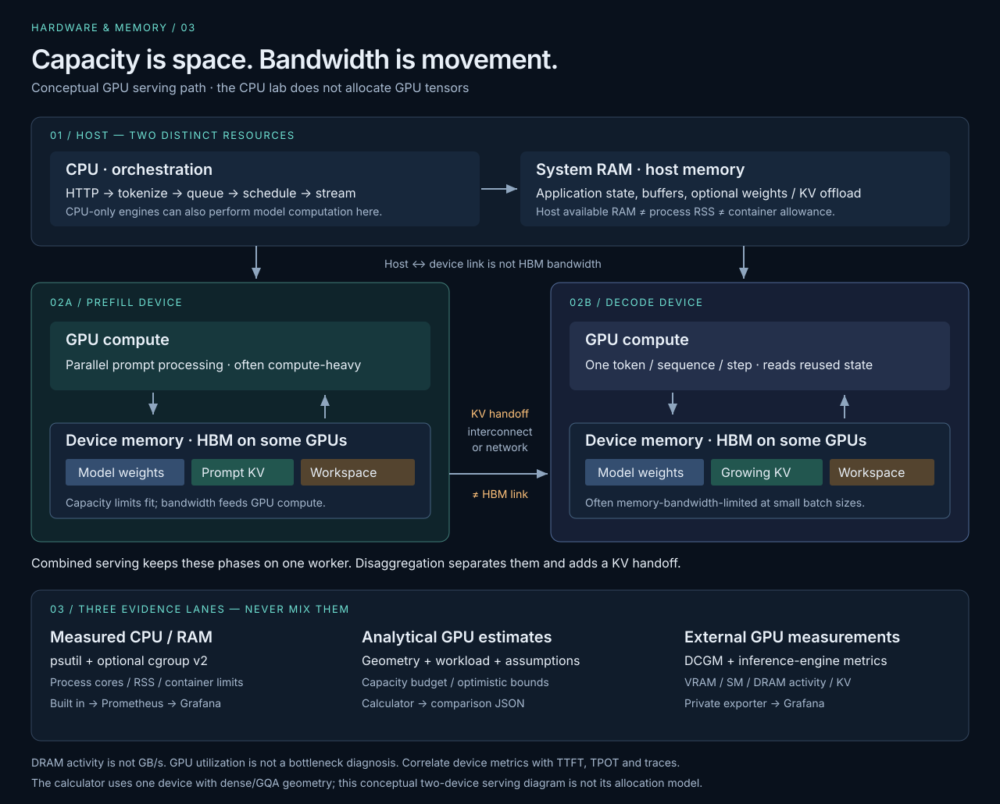

# LLM Serving Observatory

[](https://github.com/sivalinb/llm-serving-observatory/actions/workflows/ci.yaml)

A working LLM serving laboratory for learning **TTFT, prefill, decode, KV-cache transfer, CPU/RAM, GPU/HBM memory planning, disaggregation, token accounting, and observability**. Run it on a laptop or an OCI CPU VM; connect a real llama.cpp or vLLM server when available.

**Three evidence lanes:** measured serving timings · analytical GPU-memory estimates · real process/container telemetry. No GPU needed for the default lab; no GPU performance claims from simulation.

New here? Follow the [eight-minute portfolio walkthrough](docs/portfolio-walkthrough.md) or the [hardware and memory guide](docs/hardware-memory.md).

The website now opens with an **animated visual homepage**: follow a request through prefill, optional KV handoff, first visible output, decode and observability. Switch architectures, pause, restart or select any stage. The tour is explanatory, makes no model calls, and respects reduced-motion preferences. In the full application, open `/assistant` for the real service or `/lab` through your local/SSH connection for experiments.

## Public portfolio on ChatGPT Sites

[Open the public learning portfolio](https://llm-serving-observatory.siva-babu.chatgpt.site).

**[Serving Academy: learn end to end](https://llm-serving-observatory.siva-babu.chatgpt.site/learn/)** adds 20 ordered modules, 20 self-checks, a control/request/operations map, per-module observability and practice briefs, and four browser exercises. Search for a concept or filter Foundations → Engine → Scale → Operate → Applications. No account, model or GPU is required for the public lessons.

New coverage includes model/artifact lifecycle, tokenization/sampling, continuous batching, chunked prefill, paged/prefix/offloaded KV, quantization/kernels/speculative decoding, parallelism/topology, OCI/Kubernetes infrastructure, routing/autoscaling, SLOs, recovery, security, RAG/tools, multimodal/LoRA/MoE, quality releases and cost. See the [learning path and capstone checklist](docs/learning-path.md).

The public website includes the academy, animated tour, five full-size architecture diagrams and the Cloud Reliability Lab and links to this repository. **Public AI chat is not available; an invite-only OCI pilot is now deployed separately.** The academy's memory, latency, token-ledger and bounded-queue/SLO/cost exercises are analytical or simulated. This static export does not host FastAPI, llama.cpp, the private experiment lab, authentication, request history, live metrics or dashboards. ChatGPT Sites supplies hosting, not ChatGPT-powered answers. No OCI resources are created by publishing it. The updated public export states that the OCI pilot is private; cloud-reliability activation is tracked separately in its release evidence.

Build with `python scripts/build_portfolio.py`; preview with `python -m http.server 8766 --bind 127.0.0.1 --directory dist`. Only allowlisted public assets enter `dist/`. See [Sites publishing and the OCI transition](docs/sites-publishing.md). GitHub pushes validate the export but do **not** automatically redeploy Sites.

Documentation: [Learning path](docs/learning-path.md) · [Architecture](docs/architecture.md) · [Cloud Reliability Lab](docs/cloud-reliability.md) · [Observability contract](docs/observability.md) · [Phoenix service runbook](docs/servingops-runbook.md) · [Portfolio walkthrough](docs/portfolio-walkthrough.md) · [Validation evidence](reports/validation.md).

### Cloud Reliability Lab

The new `/reliability/` learning page connects the technology stack with a full-size architecture and four five-step, play/pause journeys: encrypted backup → isolated restore; health → alarm delivery; real request → sanitized APM trace; Git → reviewed Terraform. The opt-in worker is bounded to 0.1 CPU / 192 MiB, with separate dependencies and no web-app backup credentials. The dedicated Phoenix stack includes Object Storage, Vault, Monitoring/Notifications and an explicitly Always Free APM domain; it does not own or recreate the existing VM. **Check [release evidence](reports/cloud-reliability-release.md) for actual deployment gates: tested code is not proof of a delivered alert or stored cloud trace.** [Runbook and security boundaries](docs/cloud-reliability.md).

## New: ServingOps Cloud — real traffic on Phoenix Free Tier

**Already sharing an OCI VM with another application? Start with the [slim shared-host pilot](docs/oci-shared-host.md), not the full-stack commands below.** Its standalone `compose.shared.yaml` runs the assistant on loopback port 18000, a half-CPU / 2.5 GiB model, and optional small Prometheus. It disables lab/benchmark APIs, caps output at 64 tokens and uses separate storage/networks while sharing the host's hardware. Includes capacity gates, actual-limit checks, a visual architecture, search-only fallback and rollback. **Deployed privately on Phoenix A1 ARM64 on September 8; no public inference endpoint.** See [actual OCI receipts and deployment evidence](reports/oci-private-pilot.md), including the identical-prefix cache effect and missing-citation/truncation limitations.

The repository now includes an **invite-only documentation assistant** at `/assistant`: real streamed CPU inference, retrieved references, per-user access keys and isolated history, atomic quotas, cancellation/deadlines, and a separate real-traffic Grafana dashboard. No model configured? It offers document search and explicitly disables AI answers; it never substitutes simulated answers.



The default deployment uses a checksum-pinned Qwen 1.5B quantized model and a digest-pinned ARM-compatible llama.cpp container. It targets **one Always Free eligible A1 VM in `us-phoenix-1`**, with no managed inference calls, GPU or HBM. Verify current free allowance, home region and existing allocations before provisioning. This is a single-node beta, not an HA or zero-cost guarantee.

```bash
python3 scripts/download_model.py
docker compose -f compose.yaml -f compose.cpu.yaml up -d --build --wait --wait-timeout 300
docker compose exec -T gateway python -m observatory.admin invite
```

Open `http://localhost:8000/assistant` through an SSH tunnel, redeem the invite, and save the returned personal key. Follow the [complete Phoenix service runbook](docs/servingops-runbook.md) for HTTPS, monitoring, privacy, backups, rollback and the portfolio demo. The public Caddy profile exposes **the homepage and assistant**; the lab and operations console stay private.

The assistant performs real combined prefill/decode. It does **not** claim real cross-worker KV transfer or GPU disaggregation. Citations are source-ID checks, not factual validation. All real latency and token fields come from actual streams; missing usage details remain unknown.

## Private in-website observability

New users: open **Assistant → How it works** (`/assistant#system`) for a seven-step animated walkthrough of keys, workspaces, authentication, questions, search/AI, receipts and the dashboard. Examples only fill the question box; they do not submit it. **Deployed on the private OCI service September 8 at 23:28 UTC.** [First-visit guide](docs/using-the-service.md) · [Walkthrough release evidence](reports/usage-guide-release.md).

**Live on the private OCI website as of September 8, 2026.** Open `http://127.0.0.1:18000/observability` through an approved active Bastion/SSH tunnel. [Deployment checks and memory-incident resolution](reports/observability-release.md). This is not a public endpoint; the Sites academy stays separate.

The shared OCI service includes **`/observability`**, a native metrics explorer, overview/alert view, request timeline and sanitized-event viewer. Reuse your assistant key for personal records; service-wide metrics require a separate host-granted operator role. It uses existing Prometheus and SQLite storage, performs no model calls and stays outside the public academy. [Access, architecture, privacy and operating guide](docs/observability-dashboard.md). Raw container logs, stored traces, model/host resource history and GPU/HBM readings are not added by this release.

## Learning lab



## Start in two minutes

Python 3.11+ (3.12 tested):

```bash
python3 -m venv .venv
source .venv/bin/activate
pip install -r requirements.lock
pip install -e '.[dev]'
uvicorn observatory.app:app --host 127.0.0.1 --port 8000
```

Open [the visual introduction](http://localhost:8000) or [the learning lab](http://localhost:8000/lab). No cloud account, API key, model download, or GPU is needed for simulation. Existing root bookmarks such as `/#hardware` continue to the matching `/lab` view when JavaScript is enabled.

1. Run a request in **Disaggregated** mode and inspect the waterfall.
2. Run it again to see prefix-cache reuse reduce prefill work.
3. Set 8 reasoning tokens within 32 output tokens: visible output becomes 24, total remains input + 32.
4. Lower transfer bandwidth or increase prompt length to expose the handoff cost.
5. Open **Benchmarks** and compare combined versus disaggregated timing.
6. Inject a transfer failure; inspect the retained error trace and metric counter.
7. Open **Hardware & memory**, save a baseline, then try **Long context**, **4-bit weights**, and **Slower HBM path**. Export the comparison and inspect the real CPU/RAM readings below it.

## What is implemented

| Capability | Implementation | Evidence boundary |
|---|---|---|
| Combined serving | One simulated worker slot holds prefill + decode | Synthetic work; measured wall time |
| Disaggregated serving | Independent prefill/decode queues; optional separate HTTP services | Modeled transfer, no KV tensors |
| Prefix cache | Capacity-bounded LRU with hits, misses and eviction counters | Synthetic exact-prefix identity |
| Real model inference | Configured OpenAI Chat Completions stream adapter | Provider-reported usage; gateway arrival timings |
| Real GPU disaggregation | Finite vLLM/NIXL launcher using an explicit official source checkout | Requires two GPUs and hardware validation |
| Hardware planning | Interactive weight/KV/workspace budget, capacity sweep, bounds, baseline comparison and export | Hypothetical single device; no model allocations or GPU benchmark claims |
| CPU/RAM telemetry | Per-service CPU cores, RSS, host RAM and optional cgroup-v2 limits/throttling | Measured process/container aggregates, not per-request attribution |
| GPU telemetry integration | Private DCGM discovery, collector field list, GPU/DRAM/SM and VRAM panels | External compatible GPU/exporter required; no fake samples |
| Observability | Prometheus, five lab dashboards plus one real-service dashboard, OTel collector, Tempo, JSON logs | Source labels keep simulated / upstream data distinct |
| Native private dashboard | Shared-profile metric catalog/charts, alert states, request receipts, sanitized events | Operator-gated global data; no raw logs, stored traces or invented GPU readings |
| Invite-only assistant | Curated lexical retrieval, real CPU stream, hashed keys, isolated metadata, quotas | Small-model answers require source verification; no private uploads |
| Shared-host pilot | Deployed ARM64 CPU assistant with Prometheus, enforced limits, private API and real receipts | Three sequential OCI canaries, not a load/HA test; no full lab, trace backend or public edge |
| Experiment storage | SQLite WAL, bounded retention, JSON export | No prompts or generated text retained |
| OCI integration | A1 Terraform, private Object Storage, optional budget, export to Monitoring/ADB | Credentials and an OCI apply are required |
| Rich diagrams | Downloadable SVG architecture and lifecycle, live serving-path view | Diagrams document actual boundaries |

**Simulation does not prove GPU speedup.** Combined uses one slot; disaggregated uses one prefill slot plus one decode slot. Continuous batching, PagedAttention, speculative decoding, GPU allocation, and real tensor transport are engine features, not implemented by the simulator.

## Request flow



The main diagram is available as a [full-size SVG](observatory/static/architecture.svg), and the [request-flow SVG](observatory/static/request-flow.svg) explains the latency boundaries and token subsets. Both render in the application's Architecture view. [Architecture notes](docs/architecture.md) include editable Mermaid source and component responsibilities.

## From requests to hardware



The hardware view separates **capacity** (what fits), **memory bandwidth** (how quickly data reaches compute), **compute throughput** (model math), and the **network link** (KV handoff). Presets change one variable at a time. If a configuration exceeds capacity, estimated throughput is withheld rather than shown as achievable.

`python scripts/hardware_report.py` reproduces [the analytical sample report](reports/sample-hardware.json). Its complete inputs, formulas and limitations are documented in the [memory contract](docs/hardware-memory.md). These estimates do not change Live lab simulation rates.

## Separate workers + observability

Docker Engine and the Compose v2 plugin are required:

```bash
cp .env.example .env
# Set GRAFANA_PASSWORD in .env. Set LAB_API_KEY before exposing the API.
docker compose up -d --build
docker compose -f compose.yaml -f compose.observability.yaml up -d --build
```

The base Compose file runs gateway, prefill, and decode services. The second command adds the observability stack and OTel export. Ports bind to loopback:

| Surface | Local URL |
|---|---|
| Visual homepage | http://localhost:8000 |
| Lab (private) | http://localhost:8000/lab |
| Assistant | http://localhost:8000/assistant |
| API schema | http://localhost:8000/docs |
| Prometheus | http://localhost:9090 |
| Grafana | http://localhost:3000 — `admin` / your configured password |

In Grafana, open the **LLM Serving** folder for User experience, Token ledger, KV cache and handoff, Capacity and SLO, **Hardware and memory**, and **ServingOps / Real traffic beta**. The assistant dashboard uses separate `assistant_*` metrics. The hardware dashboard includes measured CPU/RAM plus optional external GPU panels; GPU panels correctly show no data until configured. For a request trace, copy its full trace ID from the receipt/exported JSON and search it in **Explore → Tempo**.

Prometheus evaluates alert rules locally. Notification delivery requires adding Alertmanager and your chosen receiver, or configuring OCI Monitoring alarms; the repository does not send notifications automatically.

## Real inference

Run a llama.cpp server with a compatible small, licensed GGUF model:

```bash
llama-server --model /path/to/model.gguf --host 127.0.0.1 --port 8080 --ctx-size 4096 --metrics
```

In a second terminal with the Python environment active:

```bash
UPSTREAM_URL=http://127.0.0.1:8080/v1 \
UPSTREAM_MODEL=your-model-alias \
UPSTREAM_KIND=llama.cpp \
uvicorn observatory.app:app --host 127.0.0.1 --port 8000
```

Use the exact model name returned by the engine's `/v1/models` endpoint, or configure its model alias. Choose **Real inference** in the private `/lab` UI. This `UPSTREAM_*` configuration is the lab adapter, not the assistant backend; use `compose.cpu.yaml` for the assistant. For a gateway inside Docker, localhost refers to the gateway container: use a reachable engine service name/private address instead.

The adapter also accepts a vLLM endpoint or the official vLLM disaggregated proxy. [GPU runbook](docs/gpu-runbook.md) documents the two-GPU launcher, baseline comparison, engine metrics, and cleanup. The default UI remains usable when GPU resources are shut down.

## Benchmark and export

```bash
python scripts/benchmark.py --requests 16 --concurrency 4 --input-tokens 2048 --prefix-tokens 1024
python scripts/smoke.py --url http://localhost:8000
```

The benchmark CLI prints a JSON report to stdout, with progress on stderr. The UI has an **Export experiment** button. For reproducible trials, record output from several independent runs and use different load patterns. Prefix keys are namespaced per experiment so prior experiments do not silently warm a run. `--warmup 0 --no-cache` is a useful uncached trial.

Each report contains configuration, environment, request records, p50/p95/p99 TTFT, p95 TPOT, successful requests/sec, generated tokens/sec, and goodput. This is **closed-loop load**: each worker submits its next request after completion. It does not establish open-loop saturation or avoid coordinated omission. Small sample p99 values are descriptive, not statistically reliable.

Use `--mode upstream --prompt '...'` for real inference. Synthetic input-length and prefix settings do not alter real engine tokenization. Use actual prompt text of the desired length for real benchmarks.

## Deploy on OCI

Follow [the OCI deployment guide](docs/oci-deployment.md). Terraform creates an A1 VM, VCN, restricted SSH ingress, and private report bucket. It does **not** provision GPUs, Autonomous Database, or a paid monitoring service implicitly.

Always Free eligibility and capacity must be checked in your tenancy's home region. The supplied A1 shape requests 2 OCPUs and 12 GB memory; those amounts are not a guarantee of free eligibility in every account. The optional budget is advisory, not a spending cap.

Once an experiment is exported:

```bash
pip install -e '.[oci]'
python scripts/export_oci.py experiment.json --bucket YOUR_PRIVATE_BUCKET --compartment YOUR_COMPARTMENT_OCID
```

`--adb` additionally stores aggregate results in an existing Autonomous Database using environment-provided connection details. No credentials are committed. See the deployment guide for configuration.

## Measurement rules

- **Gateway TTFT:** first nonempty visible content arrival minus gateway processing start. It excludes earlier HTTP middleware, client/network time before the gateway, and browser rendering.
- **E2E:** gateway processing start to final stream completion, before telemetry persistence.
- **Visible TPOT:** `(last visible arrival − first visible arrival) / (visible tokens − 1)`. Null for fewer than two visible tokens or unknown visible token count.
- **ITL:** intervals between individual synthetic tokens. Real upstream chunk intervals have a separate name; a chunk is not necessarily a token.
- **Reasoning/extended tokens:** a subset of output, not added twice. Missing provider details remain null, not zero. The app does not reconstruct or log hidden reasoning.
- **KV transfer:** simulated byte volume uses a documented dense-attention formula. Effective modeled throughput includes configured setup delay; it is not a network benchmark.
- **Cache capacity:** the serving simulator retains prefix metadata up to a modeled byte budget. The separate hardware calculator estimates end-context active KV; neither implements real allocator fragmentation or GPU OOM.
- **Hardware:** GPU budget and speed bounds are analytical estimates, not utilization measurements. Measured process CPU/RSS, host RAM and optional cgroup-v2 counters use separate names. DCGM DRAM activity is not GB/s.

The [observability guide](docs/observability.md) explains metric names, trace structure, queries, cardinality, and limitations.

## Test and repository layout

```bash
ruff check .
pytest -q
node --check observatory/static/app.js
node --check observatory/static/hardware.js
node --check observatory/static/assistant.js
node --check observatory/static/home.js
node --test tests/home-tour.test.cjs
node --test tests/academy.test.cjs
node --check observatory/static/observability.js
node --test tests/observability.test.cjs
python scripts/build_portfolio.py
python scripts/evaluate_retrieval.py
terraform -chdir=infra/oci init -backend=false
terraform -chdir=infra/oci validate
```

```text
observatory/              Gateway, assistant, identity/admission store, retrieval, simulator/workers
  static/                Animated homepage, assistant, private lab and architecture SVGs
observability/           Collector, Tempo, Prometheus, alerts, Grafana dashboards
infra/oci/               Terraform and Ubuntu cloud-init
scripts/                 Model download, real CPU/public-edge smokes, retrieval eval, lab/OCI tools
tests/                   Python service/security checks and Node homepage-animation tests
docs/                    Architecture, measurements, Phoenix service/OCI/GPU runbooks, portfolio guide
sites/                   Reviewed curriculum, academy template/styles and pure browser teaching models
.openai/hosting.json      Sites project binding and static-output configuration (no credentials)
.github/workflows/       Python/Node checks, real CPU inference, public edge, telemetry, Terraform
```

This is a single-node learning system and invite-only service beta. The assistant already has personal keys, isolated request metadata, quotas and bounded admission; the private lab still has shared experiment state. Use exactly one gateway worker: counters and simulator state are process-local, and SQLite is not a cross-host distributed store. Shared storage/admission, stronger edge protection, multi-replica recovery and measured capacity are still required for a larger production service. The documented private OCI pilot does not establish public-service readiness or an HA guarantee.

## Sources

- [vLLM disaggregated prefill](https://docs.vllm.ai/en/latest/features/disagg_prefill/)
- [vLLM NIXL guide and metrics](https://docs.vllm.ai/en/v0.24.0/features/nixl_connector_usage/)
- [vLLM production metrics](https://docs.vllm.ai/en/latest/usage/metrics/)
- [llama.cpp server](https://github.com/ggml-org/llama.cpp/tree/master/tools/server)
- [OpenTelemetry GenAI conventions](https://opentelemetry.io/docs/specs/semconv/registry/attributes/gen-ai/)
- [OCI Always Free resources](https://docs.oracle.com/en-us/iaas/Content/FreeTier/freetier_topic-Always_Free_Resources.htm)
- [OCI OpenTelemetry monitoring tutorial](https://docs.oracle.com/en/learn/oci-apm-with-opentelemetry/index.html)

Documentation checked 2026-09-07. Engine APIs evolve; pin and record the exact versions used for hardware experiments.
