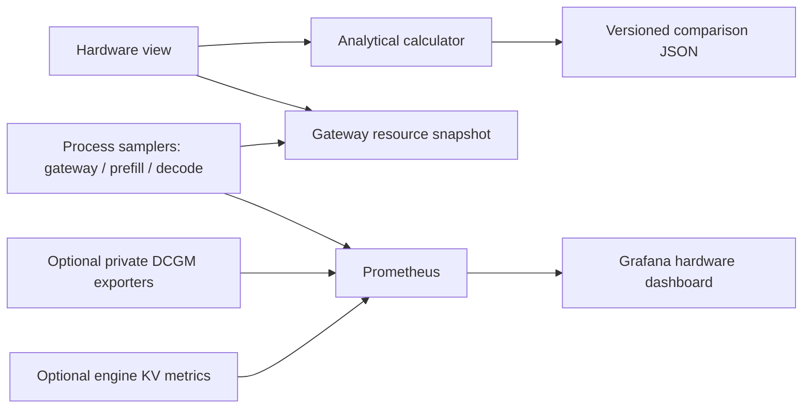
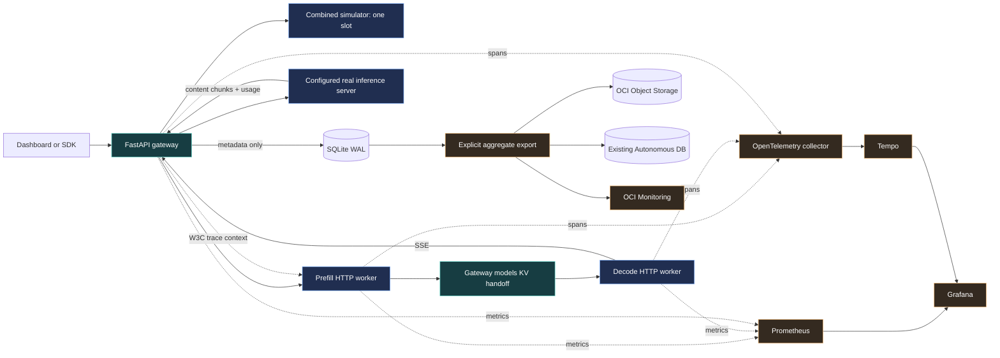
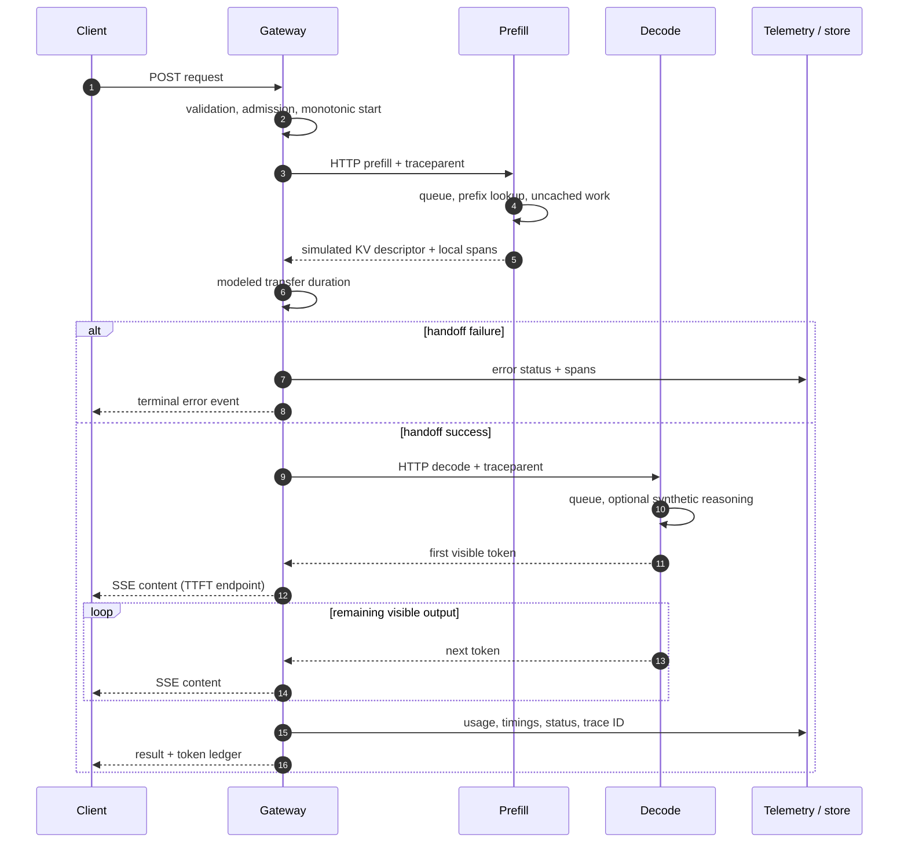

# Architecture and design decisions

The [Cloud Reliability Lab](cloud-reliability.md) adds an optional isolated worker and supporting OCI services around the existing private assistant. [Deployment evidence](../reports/cloud-reliability-release.md) distinguishes implemented paths from verified integrations. Its animated public `/reliability/` page contains no operational API access.

## Current application surfaces

The public export also includes the [Serving Academy](learning-path.md) at `/learn/`: 20 ordered modules, 20 self-checks, four browser exercises, a control/request/operations map and a layer-by-layer observability map. `sites/curriculum.json` is validated and escaped into static HTML; pure browser functions handle exercises without APIs or persistence. This is not a new FastAPI route or a real GPU-serving implementation.

The table below describes the **FastAPI application's routes and optional full-stack Caddy boundary**, not the public ChatGPT Sites export. The [Sites portfolio](sites-publishing.md) serves the animated introduction, academy and architecture diagrams, with public AI chat still pending. Its artifact contains no API, model, database or live telemetry. The current [private shared-host OCI pilot](oci-shared-host.md) runs the bounded CPU assistant, native dashboard and small Prometheus over an approved tunnel; it has no public Caddy edge or full lab/trace stack.

| Route | Purpose | Public HTTPS access |
|---|---|---|
| `/` | Animated beginner introduction; combined/disaggregated conceptual tour | Yes; no authentication or model calls |
| `/assistant` | Curated documentation search and optional real CPU answers | Page is public; search/answers require a personal key |
| `/api/service/*` | Status, invite redemption, authenticated usage/history and streaming | Explicitly allowed; individual route authentication applies |
| `/assistant#system` | Seven-step animated first-visit guide; example buttons only fill the question box | Same assistant page; new explanatory assets are allowlisted, no credentials or live telemetry in the guide |
| `/observability`, `/api/observability/*` | Native metrics/alerts, request receipts and sanitized events | Blocked by public Caddy; private key required for data, separate operator role for global data |
| `/lab` | Experimental serving, hardware planner and benchmarks | No; local connection or SSH tunnel only |
| `/metrics`, API docs, lab APIs | Operator telemetry and experiments | Blocked by the public Caddy allowlist |

The homepage is a static HTML/CSS/JavaScript state machine. Its sequence is explanatory, not a replay of a measured request. It does not fetch data or invoke the model. Pause, restart, direct stage selection and reduced-motion behavior are covered by Node tests. Root bookmarks such as `/#hardware` redirect to `/lab#hardware` in the browser; that does not bypass the public route boundary.

The real assistant uses `Assistant.prepare` and a separate SQLite identity/admission ledger, not the lab's `Service.run` or shared experiment history. The path is: authenticate → retrieve approved excerpts → reserve quota/capacity atomically → stream from the private llama.cpp model → reconcile usage and retain metadata. Exactly one real assistant answer is admitted at a time; failures and cancellations retain conservative quota reservations. Questions and generated text are not persisted. The CPU engine performs real combined prefill/decode; its KV cache stays in that engine's host RAM.

The same SQLite volume now includes `operator_grants` and bounded `service_events`. An invitation grants personal access, not global observability. Host-side role grants allow a read-only, bounded Prometheus adapter and all-project metadata queries; authorization is rechecked on privileged calls. Events use a closed schema and omit prompt/answer/key text. There is no arbitrary PromQL proxy, raw-log backend or stored distributed trace in the shared profile. See the [dashboard architecture](observability-dashboard.md) and [user walkthrough](using-the-service.md).

Read the [service runbook](servingops-runbook.md) for deployment, privacy, retention, source-citation limitations and recovery. The remaining diagrams and lifecycle descriptions below describe the **learning lab**, whose disaggregated transfer is modeled rather than a real tensor handoff.

## Hardware extension (v0.2)

The Hardware view calls a pure, bounded single-device calculator at `/api/hardware/estimate`. It allocates no model memory and does not alter serving timings. A separate background sampler measures the gateway and each worker process using psutil and optional cgroup-v2 namespace-root counters. The UI reads the gateway snapshot; Prometheus scrapes all three services. External DCGM targets supply actual GPU telemetry only when explicitly configured.

Read the [formula and measurement contract](hardware-memory.md), [exporter setup](hardware-telemetry.md), and [portfolio walkthrough](portfolio-walkthrough.md). The two-device diagram is a conceptual serving path, not the calculator's single-device allocation model.

## Learning-lab runnable paths

`Service.run` is the request lifecycle owner. It records a monotonic start, opens a trace, selects an iterator, measures visible content arrivals, persists metadata on all terminal paths, and emits the final record. Exceptions expose only an exception class; provider response bodies are excluded from stored diagnostics.

For the default one-process development path, two independent simulator semaphores model prefill and decode. Docker Compose changes only disaggregated simulation into separate HTTP services. The combined baseline remains in the gateway process. A remote prefill response contains byte-count metadata; the gateway waits for the transfer model, then asks the remote decode service to emit synthetic tokens. The diagram's handoff arrow represents this logical control path, not a direct worker-to-worker tensor copy.

Prefix-cache reuse is exact for `(synthetic model version, prefix_key, prefix_tokens)`. It is not fuzzy matching, tokenization of real prompts, or a cross-user cache. Metadata fits a bounded modeled byte budget. The simulator uses one fixed dense-attention geometry: 16 layers, 8 KV heads, head dimension 128, 2 bytes per value. This yields 65,536 bytes per token. GPU tensor parallel sharding, MLA, sliding windows and quantization change the formula and are outside this model.

## Learning-lab request sequence

## Scope and extension points

- Admission and request deadlines bound the lab's work; benchmark concurrency is capped at 8 and only one benchmark runs at a time.
- HTTP models forbid unknown fields. The Chat Completions compatibility endpoint supports text messages, one completion, temperature, max_tokens and streaming usage. Tools, multimodal messages and the full provider protocol are not claimed.
- Requests and benchmark reports share bounded SQLite retention (2,000 records by default). No prompt or generated output is saved. Full benchmark records are included in exported experiments; the OCI exporter sends only aggregate summaries.
- Existing OpenTelemetry context is extracted at the gateway and simulated workers, then injected on outgoing HTTP calls. Engine support for propagated trace context is engine/version-dependent.
- Real vLLM P/D uses the official NIXL proxy and actual KV transport in the external environment. The lab's generic adapter observes the proxy as an upstream engine. It does not fabricate per-request GPU transfer spans.
- Horizontal scaling requires a shared experiment store, distributed admission, service discovery and cache-aware routing. Those changes are deliberately separate from learning the lifecycle on a small VM.
