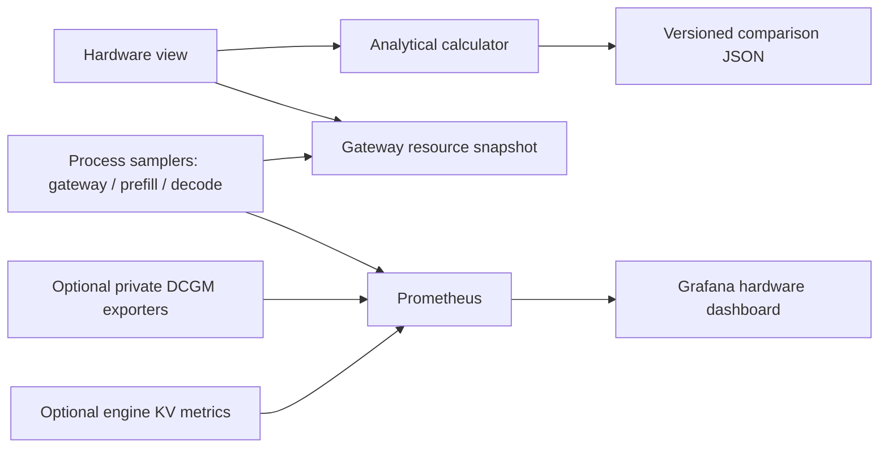
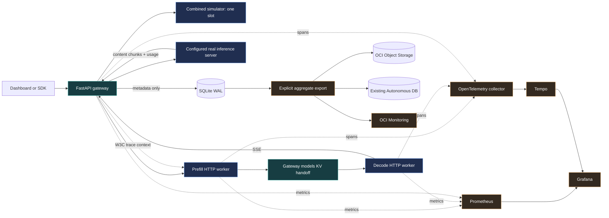
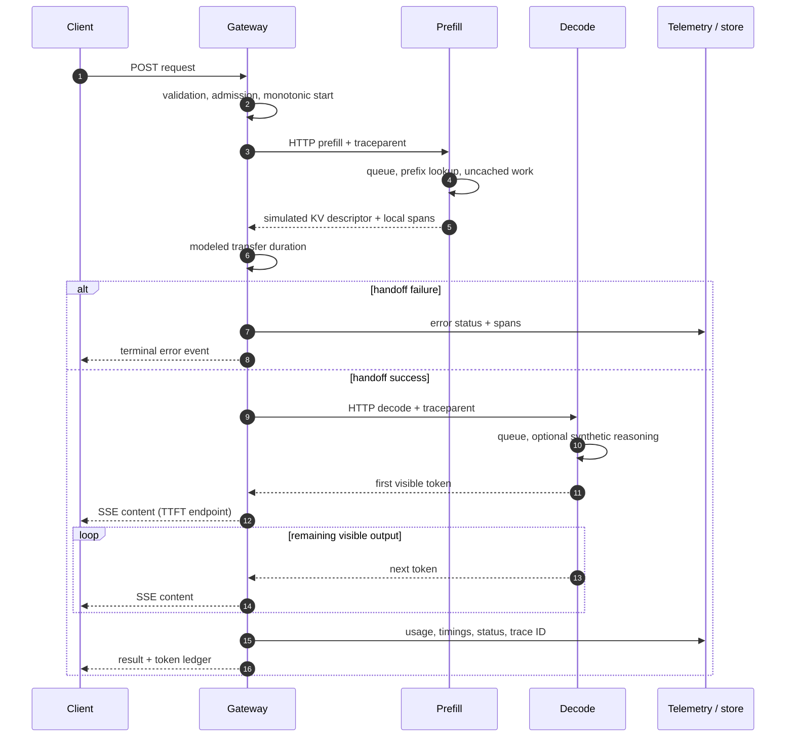

# Architecture and design decisions

## Hardware extension (v0.2)

The Hardware view calls a pure, bounded single-device calculator at `/api/hardware/estimate`. It allocates no model memory and does not alter serving timings. A separate background sampler measures the gateway and each worker process using psutil and optional cgroup-v2 namespace-root counters. The UI reads the gateway snapshot; Prometheus scrapes all three services. External DCGM targets supply actual GPU telemetry only when explicitly configured.

Read the [formula and measurement contract](hardware-memory.md), [exporter setup](hardware-telemetry.md), and [portfolio walkthrough](portfolio-walkthrough.md). The two-device diagram is a conceptual serving path, not the calculator's single-device allocation model.

## Runnable paths

`Service.run` is the request lifecycle owner. It records a monotonic start, opens a trace, selects an iterator, measures visible content arrivals, persists metadata on all terminal paths, and emits the final record. Exceptions expose only an exception class; provider response bodies are excluded from stored diagnostics.

For the default one-process development path, two independent simulator semaphores model prefill and decode. Docker Compose changes only disaggregated simulation into separate HTTP services. The combined baseline remains in the gateway process. A remote prefill response contains byte-count metadata; the gateway waits for the transfer model, then asks the remote decode service to emit synthetic tokens. The diagram's handoff arrow represents this logical control path, not a direct worker-to-worker tensor copy.

Prefix-cache reuse is exact for `(synthetic model version, prefix_key, prefix_tokens)`. It is not fuzzy matching, tokenization of real prompts, or a cross-user cache. Metadata fits a bounded modeled byte budget. The simulator uses one fixed dense-attention geometry: 16 layers, 8 KV heads, head dimension 128, 2 bytes per value. This yields 65,536 bytes per token. GPU tensor parallel sharding, MLA, sliding windows and quantization change the formula and are outside this model.

## Request sequence

## Scope and extension points

- Admission and request deadlines bound the lab's work; benchmark concurrency is capped at 8 and only one benchmark runs at a time.
- HTTP models forbid unknown fields. The Chat Completions compatibility endpoint supports text messages, one completion, temperature, max_tokens and streaming usage. Tools, multimodal messages and the full provider protocol are not claimed.
- Requests and benchmark reports share bounded SQLite retention (2,000 records by default). No prompt or generated output is saved. Full benchmark records are included in exported experiments; the OCI exporter sends only aggregate summaries.
- Existing OpenTelemetry context is extracted at the gateway and simulated workers, then injected on outgoing HTTP calls. Engine support for propagated trace context is engine/version-dependent.
- Real vLLM P/D uses the official NIXL proxy and actual KV transport in the external environment. The lab's generic adapter observes the proxy as an upstream engine. It does not fabricate per-request GPU transfer spans.
- Horizontal scaling requires a shared experiment store, distributed admission, service discovery and cache-aware routing. Those changes are deliberately separate from learning the lifecycle on a small VM.
