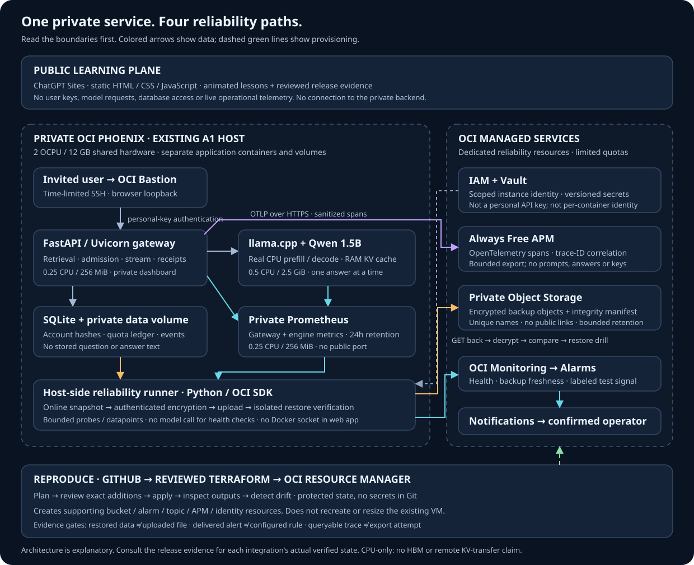

# Cloud Reliability Lab

The private assistant already serves real CPU inference on the shared Phoenix VM. This extension teaches four operational outcomes: **recover data, deliver alerts, find a stored request trace, and reproduce supporting infrastructure**. The public `/reliability/` page is an animated explanation, not a live control panel.



## Release truth

See [the release evidence](../reports/cloud-reliability-release.md) before calling any integration live. Code, a successful plan, an accepted upload and a received notification are different milestones. Existing deployment reports remain historical evidence for their dated releases.

## Technology and responsibility

| Component | Where it runs | Responsibility and boundary |
|---|---|---|
| Static HTML/CSS/JS | Public ChatGPT Sites | Lessons, manual/play/pause diagrams; no private API calls |
| Bastion + SSH | OCI + operator computer | Time-limited access to private loopback service |
| FastAPI / Uvicorn | Existing shared VM, gateway container | Key authentication, owned workspaces, retrieval, admission, streaming and request receipts |
| llama.cpp / GGUF | Existing isolated CPU model container | Actual prefill, KV reuse and decode; CPU RAM, not GPU HBM |
| SQLite / WAL | Existing dedicated assistant volume | Accounts, hashed keys, ledger and sanitized operational events |
| Prometheus | Existing small private container | Gateway/engine metrics and private dashboard query source |
| Python / OCI SDK / AES-GCM | New opt-in one-shot worker container | Read-only live DB snapshot, authenticated encryption, upload and isolated restore; health probes without model calls |
| OCI Vault | Dedicated reliability compartment | Versioned backup encryption key and private APM upload key |
| OCI Object Storage | New private Standard bucket | Off-host encrypted snapshots; seven-day lifecycle expiry |
| OCI Monitoring → Notifications | Dedicated reliability compartment | Low-cardinality signals, alarm transitions and confirmed email delivery |
| OpenTelemetry → Always Free APM | Gateway → Phoenix HTTPS endpoint | Sanitized real spans; no question, answer, key or account payload |
| Git / Terraform / Resource Manager | Repository → managed control plane | Reviewed supporting-resource plan and protected state; no ownership of the existing VM |

## 1. Recover: upload is not recovery

`observatory.reliability backup` uses SQLite's online backup API, including committed WAL records. It does not copy a potentially inconsistent live `.sqlite` file. A snapshot is bounded to 8 MiB and 20 seconds. AES-256-GCM encrypts the snapshot with a random nonce; authenticated metadata binds bucket, unique object name, digest, size and Vault key version. User rows never appear in stdout.

The worker uploads once under `backups/<random-id>.obk`, downloads the object, fetches the matching historical Vault key version, authenticates/decrypts it and checks SQLite integrity and six table counts in a temporary isolated restore. Only then does it update `latest-backup.json`. It never overwrites the live database or an existing restore target. Temporary plaintext snapshots are removed when the operation exits; named manual restores are private and must be handled as sensitive account data.

The intended timer runs daily. Each envelope is capped at 12 MiB; the worker refuses a new upload when the dedicated prefix has 14 objects or a continuation page. This is at most 168 MiB of envelopes if only this worker writes the bucket, not a tenancy-wide quota. Seven-day lifecycle expiry is asynchronous, not exact-time deletion or immutable retention. The VM cannot delete/overwrite cloud objects; a separate Oracle lifecycle-service policy permits expiry in the dedicated compartment. Keep historical Vault versions longer than the retention window. A compromised VM with the backup key can read backups: encryption is not a substitute for host isolation.

Proof records restore verification time, snapshot age, counts and SHA-256. These are drill measurements, **not contractual RTO/RPO**. Restoration onto the live service is a separate approved maintenance operation requiring traffic drain, rollback backup, ownership checks and post-restore authentication tests; no script here performs that promotion.

## 2. Detect: absent is not healthy

| Metric (`observatory_reliability`) | Meaning | Action |
|---|---|---|
| `ServiceHealthy` | Gateway liveness succeeded, assistant-only profile | Inspect gateway; not proof that a model can answer |
| `EngineScrapeHealthy` | Prometheus reports `up` for `shared-model` | Inspect scrape/engine; not a correctness evaluation |
| `BackupVerified` | A locally recorded successful upload/download/restore exists | Missing record becomes 0, never invented success |
| `BackupAgeSeconds` | Age of last verified snapshot; omitted if unknown | Warning above 26 hours; not a guaranteed RPO |
| `HostAvailableMemoryBytes` | Host `/proc/meminfo` aggregate | Compare with cgroup limits privately; not worker/GPU memory |
| `ReliabilityDrill` | Separately labeled synthetic 0/1 test | Demonstrate firing and recovery without stopping inference |

Real signals carry `service=servingops, source=measured`; the drill uses `source=drill`. Six Terraform alarms cover liveness, scrape failure, missing/stale backup, absent worker heartbeat and the safe drill. The heartbeat absence alarm has a ten-minute pending period. Review actual Monitoring windows and transitions after deployment. Metric acceptance is not alarm delivery.

Confirm OCI's subscription email first. Publish the drill signal for at least two consecutive one-minute windows, inspect the `FIRING` transition, verify the operator actually receives it, then publish zero and verify recovery. Do not generate fake success evidence or stop the model to test an alarm. Email confirmation and receipt require the recipient; this application cannot acknowledge them for the user. A silent inbox can mean unconfirmed subscription, alarm delay, missing signal or mail filtering.

## 3. Trace: actual boundaries, private content

The optional `compose.apm.yaml` sends protobuf OTLP over HTTPS to the provisioned Phoenix private ingestion path. The upload key is fetched from Vault by the worker into a mode-0600 runtime file and mounted read-only into the gateway. The web app does not receive the backup key, OCI SDK or Docker socket. Instance-principal identity is **VM-wide**, however; it is not container-level IAM isolation. Avoid untrusted co-tenants and assume a host compromise crosses these boundaries.

Four allowlisted spans describe admitted streaming requests: `assistant.request`, `assistant.retrieval`, `assistant.admission`, `assistant.model_stream`. Retrieval/admission timestamps are captured when those operations occur, not fabricated later. The root starts at preparation; HTTP authentication and rejected pre-stream requests are not included. Engine token-by-token generation and GPU timings are not invented. Root/child exception auto-recording is disabled, and the export boundary independently removes events, links, error descriptions, arbitrary attributes and default host resources.

Exported attributes are bounded backend/status/error enums plus finite nonnegative retrieval time, TTFT and reported output tokens. No prompts, answers, source text, user IDs, key values or request headers are exported. Trace/span IDs and timings remain operational metadata with privacy implications. Trace IDs still appear in private request receipts.

The exporter buffers at most 64 spans, batches 16 and uses a three-second transport timeout. It attempts up to 900 allowlisted spans per rolling hour **per process**; failures consume budget. Restarts reset that local budget, retries can repeat spans, queue pressure can drop spans and traces can be partial. OCI's Always Free domain limit is the final ingestion cap; this is not a billing guarantee. `assistant_cloud_spans_total{result=attempted|failed|filtered|budget_dropped}` is private Prometheus evidence. An accepted export must still be followed by finding the same real trace ID in APM. Export failure does not turn a successful model answer into an error. Invalid opt-in endpoint/key configuration fails gateway startup so deployment validation must catch it before cutover.

## 4. Reproduce: explicit plan and apply

`infra/reliability` is a separate supporting-resource stack. It does not import, resize or recreate the existing VM/VCN or the incumbent application's bucket. Terraform explicitly selects a DEFAULT Vault, SOFTWARE encryption key, private Standard bucket and `is_free_tier=true` APM domain. Secrets are created after apply and never enter Terraform state. The notification email is sensitive in Terraform output but exists in protected Resource Manager variables/state; state still needs restricted IAM.

`scripts/reliability_cloud.py` runs in an authenticated OCI Cloud Shell task checkout. It packages only the Terraform configuration and provider lock. Each action is separate: `create-stack`, `plan`, `job`, `review`, `review-resume`, `apply-reviewed`, `outputs`, `bootstrap`, `drift`. The first apply must match the exact 17-resource create-only allowlist and the previously reviewed plan digest. It cannot silently adopt existing resources. A failed/ambiguous create must be reconciled before retrying, to avoid duplicates. Later updates require a new reviewed workflow; the guard intentionally rejects in-place updates/deletes.

For a partial apply, first inspect errors and the failed job's state. Resolve the cause without widening scope. `plan` records that failed apply; `review-resume` permits only unchanged, exact-ID resources from that job and creation of missing members of the same 17-resource set. It rejects replacements, modifications, tainted resources and deletions. Inspect the resulting list before invoking the separate `apply-reviewed` action. Never replay the original plan or create a second stack to work around a partial failure. A newly created Vault endpoint may need DNS propagation even after the Vault reports active; wait for actual resolution and review a new plan rather than changing IAM or buying another Vault.

Use a private `--state /absolute/task/path/.reliability` directory. `create-stack` additionally needs the approved `--instance`, a unique `--suffix` and operator-supplied `--email`; it reads the tenancy from the Cloud Shell environment. The CLI uses JSON stdin for secret payloads and prints no CLI error bodies. Review Resource Manager diagnostics privately if an action fails. The bootstrap writes only secret OCIDs and runtime configuration, not secret values. It refuses to overwrite an existing configuration.

### Deployment gates and commands

1. Recheck Free Tier status, region PHX, existing object bytes, available APM/Vault/secret quotas and shared-host CPU/memory/disk headroom. No paid-tier fallback, new compute or resizing. Budgets alert; they do not cap spending.
2. Run local tests, Terraform validation and reviewed Resource Manager plan. Approve the exact new IAM scope, encrypted account-data backup destination and seven-day expiry. The dynamic group matches only the already-approved VM; it can create/read/inspect objects in the new bucket, read secrets in the new dedicated compartment and publish only the reliability namespace.
3. Apply that saved plan, inspect actual resources and confirm the email subscription. Run `outputs` and `bootstrap`; reconcile partially created secrets instead of rotating automatically.
4. Renew an approved Bastion session. Copy the non-secret-ID `config.json` privately to `/home/opc/llm-serving-observatory/.reliability/config.json`. Directory mode 0700 and file mode 0600, owned by UID 10001 for the worker. Create a root-owned mode-0600 `.reliability-runtime.env` file at the checkout root, outside the worker-writable `.reliability/` directory, with `RELIABILITY_PRIVATE_DIR` set to that directory and `OCI_APM_ENDPOINT` set to the provisioned upload origin. Never put the key itself in this file, shell history, Compose environment or Git.
5. Build `Dockerfile.reliability` only after host-capacity checks; record its actual image digest. It is not automatically started. The worker uses 0.1 CPU, 192 MiB RAM/no swap, 16 MiB temporary storage, read-only root/live DB and no capabilities. Dependency installation/build load needs its own capacity check; runtime limits do not cap Docker builds.

```sh
# In the existing VM checkout; .reliability-runtime.env must already be protected/configured.
sudo docker compose --env-file .reliability-runtime.env -f compose.shared.yaml -f compose.reliability.yaml --profile reliability build reliability
sudo docker compose --env-file .reliability-runtime.env -f compose.shared.yaml -f compose.reliability.yaml --profile reliability run --rm --no-deps --pull never reliability --config /private/config.json backup
sudo docker compose --env-file .reliability-runtime.env -f compose.shared.yaml -f compose.reliability.yaml --profile reliability run --rm --no-deps --pull never reliability --config /private/config.json probe
sudo docker compose --env-file .reliability-runtime.env -f compose.shared.yaml -f compose.reliability.yaml --profile reliability run --rm --no-deps --pull never reliability --config /private/config.json prepare-trace-key /private/apm-upload-key
```

6. Verify restore, metrics and instance-principal access from the **actual container**. Read-only SQLite WAL access and metadata-network routing are live gates, not assumed from unit tests. Before installing the provided systemd service/timers, create `/etc/observatory-reliability` as root mode 0700 and install the non-secret runtime environment there as `runtime.env`, root mode 0600. Run `restorecon -RF /etc/observatory-reliability` on SELinux hosts. Systemd reads this protected `/etc` copy, not a home-directory file that SELinux may deny. Never put it in the worker-writable mount or disable SELinux. Units use the existing explicit checkout path and never invoke an unbounded full Compose stack. Verify `Result=success` and `ExecMainStatus=0` for an actual systemd probe, not just an enabled timer.
7. For tracing, rebuild the gateway at the tested source revision, drain/check active requests, keep its previous image, and recreate **only gateway** using `compose.shared.yaml` plus `compose.apm.yaml` and the protected runtime environment. Do not restart model, Prometheus or the other application. Preserve gateway limits, model digest and loopback-only port. Send one bounded authorized canary and find its trace ID in APM. Check memory, swap, OOM, health and restart counters again.
8. Run the safe notification drill, verify received fire/recovery messages, and request drift detection. Record results with dates; redact identifiers/private data from public evidence. Only then change a milestone from pending to verified.

For timers, install `infra/reliability/compose.worker.yaml` beside the `/etc` environment, root-owned mode 0600, and restore its SELinux context. This worker-only definition references the already-existing `observatory-shared_access` network and `observatory-shared_assistant-data` volume as **external** resources. It cannot recreate the application stack and never reads Compose files from the home directory. The root host Docker client uses its normal SELinux domain transition; applying `NoNewPrivileges=true` to that host client prevents Docker-socket access on this Oracle Linux host. The worker itself still runs as UID 10001 with `no-new-privileges`, dropped capabilities, read-only root/database and the same CPU/memory/no-swap limits. The root timer is a privileged orchestrator, not a security sandbox; protect its installed definitions and environment from application writes.

### Pause and rollback

Disable only `observatory-reliability-probe.timer` and `observatory-reliability-backup.timer` to pause worker activity. Remove only the APM overlay from the gateway deployment and use the recorded prior gateway image if needed. Keep the existing model and data volumes intact. Review the resulting missing-heartbeat alarm rather than assuming silence. Keep backup objects, Vault versions and Resource Manager state for recovery. Destruction is deliberately prevented on core resources; deletion of backups/secrets/compartment requires separate operator approval and retention review. No `down -v`, broad deletion or Terraform destroy is part of this runbook.

## Portfolio walkthrough

Start with a real request receipt and explain CPU RAM/KV reuse/TTFT. Open the private dashboard for measured metrics. Show a sanitized four-span stored trace. Then demonstrate a restored backup, a delivered labeled alarm and the reviewed infrastructure plan. End with honest limitations: one shared VM, no HA, no GPU/HBM, limited small-model quality, bounded rather than complete tracing, email dependency, and recovery that still needs an operator. This is stronger evidence than a diagram full of services that were never exercised.

## Primary references (checked September 2026)

- [OCI lifecycle service permissions and asynchronous expiry](https://docs.oracle.com/en-us/iaas/Content/Object/Tasks/usinglifecyclepolicies.htm)
- [OCI APM OTLP private endpoint and authorization](https://docs.oracle.com/en-us/iaas/application-performance-monitoring/doc/configure-open-source-tracing-systems.html)
- [APM Always Free limits](https://docs.oracle.com/en-us/iaas/application-performance-monitoring/doc/application-performance-monitoring-terminology.html)
- [Resource Manager supports Terraform 1.5.x](https://docs.oracle.com/en-us/iaas/Content/ResourceManager/Reference/terraformversions.htm)
- [Create a Resource Manager stack from a ZIP](https://docs.oracle.com/en-us/iaas/Content/ResourceManager/Tasks/create-stack-local.htm)

Always Free allowances are tenancy-wide and subject to Oracle's current eligibility/limits. Do not assume this project's safeguards protect unrelated resources or guarantee a zero invoice.
