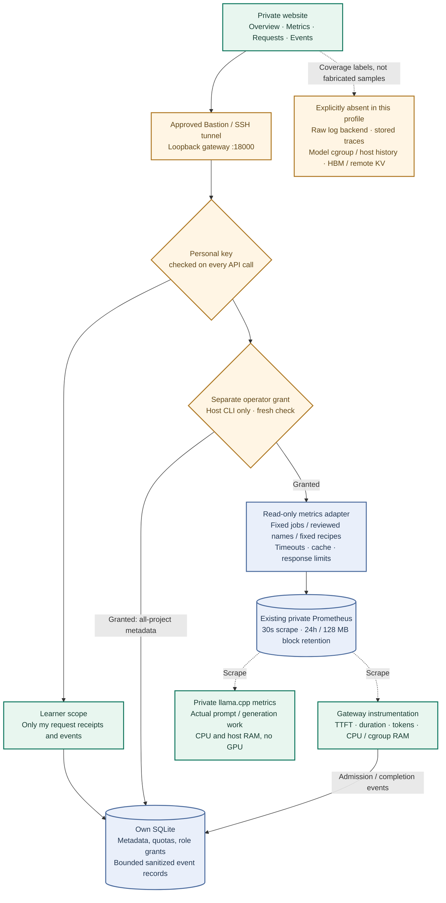

# In-website observability

Open **`/observability` on the private OCI gateway**, beside `/assistant`. This is a native dashboard, not an embedded Grafana iframe. It reuses the existing shared-profile Prometheus and assistant SQLite ledger: no additional container, cloud service, paid model call or public route is required.

For access through an active approved tunnel, use `http://127.0.0.1:18000/observability`. A localhost URL is not a public website; it stops working when its SSH/Bastion session expires. The public Sites academy stays static and disconnected from this API.

## Follow the signals



The browser never receives a Prometheus address or query expression. It cannot select another backend, access a Docker socket, read host files or issue arbitrary PromQL. No connection to the incumbent application's collector or dashboards is added.

## Start as a learner; explicitly grant operators

1. Redeem an assistant invitation at `/assistant`. Save the personal key in your password manager; the service stores only its hash.
2. Paste the key into `/observability`. It remains in this page's memory only, never browser storage or a URL. Reload, navigation away, sign-out, key revocation or rejected operator access clears the dashboard session. This page does not revoke your underlying personal key on ordinary sign-out.
3. A normal invitation opens **My requests** and **My events**, not service-wide metrics. The page displays the authenticated user ID for an operator to verify.
4. On the approved VM, in the dedicated checkout, explicitly grant the verified user ID:

```bash
sudo -n docker compose -f compose.shared.yaml exec -T gateway \
  python -m observatory.admin operator grant VERIFIED_USER_ID
```

Reconnect the dashboard with the same key. **Overview & alerts**, **Metric explorer** and **All project** metadata scopes become available. The grant is attached to the user, so rotating that user's key preserves their role. Ordinary assistant invitations never grant it. There is no HTTP role-management endpoint.

To remove operator access without removing personal assistant access:

```bash
sudo -n docker compose -f compose.shared.yaml exec -T gateway \
  python -m observatory.admin operator revoke VERIFIED_USER_ID
```

To revoke all of that user's personal keys, use the existing `observatory.admin revoke VERIFIED_USER_ID`. API calls recheck both the key and, for privileged routes, the operator grant. Already rendered data cannot be retroactively recalled from a browser; the next privileged refresh is rejected and clears this page. Grant access only to trusted operators.

## What each section teaches

| Section | Available now | What it does not imply |
|---|---|---|
| Overview | Output counters, cached-input share, active answers, engine-reported generation rate, scrape freshness, gateway CPU/RSS/cgroup memory/throttling | Counters are exporter-process totals, not billing or lifetime SQLite totals; gateway RAM is not model RAM |
| Metric explorer | Search recent reviewed metric names, HELP/type/unit, raw values, four time windows, bounded multi-series charts, sample tables | This is not every metric in an arbitrary Prometheus deployment; only this project's two jobs and reviewed namespaces |
| Guided calculations | Estimated p95/mean TTFT, output-token rate and cached-input share using fixed five-minute rates | Sparse traffic makes rates/percentiles unstable; one request cannot substantiate a population p95 claim |
| Request explorer | Seven-day retained metadata, outcome/request-prefix filters, first-content versus subsequent-stream timeline, tokens, finish reason, citations, related events | No prompts/answers; retrieval is inside TTFT, not an extra stacked stage; no engine-internal prefill/decode spans |
| Alert rules | Three shared-profile rules: target down, repeated answer failures, gateway memory pressure; state and evaluation health | Inactive is not a service-level guarantee; there is no configured email/page receiver |
| Events | Admission, completion, sanitized rejection, service start and role changes; time/type/request correlation | These are bounded application events, not raw Docker logs, complete security audit records or a replacement for Loki |

Cached input and reasoning are **subsets**, not extra tokens to add to input/output totals. Unknown engine usage is shown as **Unknown**, never a fabricated zero. Receipt success means the stream completed; length-limited output and missing citation IDs still receive a quality warning. Source IDs are not factual verification.

The first-content timeline is gateway-observed timing, excluding browser/network delay. A trace ID enables correlation only: this shared profile has no persisted trace backend, so the page does not invent a distributed waterfall or query nonexistent spans.

## Collection and read budgets

`compose.shared.yaml` supplies the fixed internal `OBSERVATORY_PROMETHEUS_URL=http://prometheus:9090`. Omit the variable for metadata-only local use: metrics show **disabled**. If the URL is configured but Prometheus is stopped/unreachable, metrics show **unavailable**, not healthy empty charts. Full-lab Prometheus uses different job labels; this first adapter deliberately targets the shared deployment.

| Boundary | Limit |
|---|---|
| Browser refresh | 30 seconds, active section only; stopped when hidden or signed out |
| Authenticated dashboard budget | 60 API requests/minute/user, 512-user bounded in-process limiter; resets on process restart |
| Backend access | One HTTP connection and serialized cache/query work; 3s HTTP / 1s connect timeout; 5s overall per cache builder; query timeout 2s |
| HTTP and cache payloads | 1 MiB incoming Prometheus JSON; 256 KiB per cached result; 24 cache entries / 2 MiB serialized cache budget (not total Python RSS) |
| Cache freshness | 30s positive/negative cache; last-good data at most 120s old on failures; marked **stale**, then withheld |
| Catalog | At most 512 reviewed raw names from the two jobs seen in the last five minutes, plus four fixed recipes; bounded HELP/unit/type text |
| Time-series response | 15m / 1h / 6h / 24h only; at most 8 series × 121 points; truncation disclosed |
| Browser labels | Reviewed job/kind/status/result/bucket/runtime labels only; no target addresses, arbitrary labels or provider error text |
| Requests | 50 metadata rows/page, offset at most 1,000; scope checks apply before SQL selection |
| Events | 50 rows/page using a descending ID cursor; at most 2,000 stored rows and 24h visible retention |

Prometheus evaluation timestamps are **not scrape freshness**. Check the target's last scrape separately; the UI marks a scrape older than 90s as stale. Missing or nonfinite values remain null. Gauge zero remains zero. Historical metric families that disappeared from the recent catalog may be inaccessible through this bounded explorer. Histogram bucket charts may show only the first eight series; use the guided aggregate recipes when appropriate.

## Privacy, deletion and storage

Event fields are a closed schema: event time/type, bounded enum code, validated user/request/trace IDs and optional finite duration. No arbitrary text, exception body, headers, invitation/key, prompt or answer is accepted. User IDs are used for authorization but omitted from event responses. Duplicate admission rejections for the same user/code within 30s are coalesced. Event capture begins with this release; historical stdout is not imported.

Event expiry is filtered on reads and physically pruned on the next write. The 2,000-row cap is not a byte-accurate SQLite/WAL disk cap. Deleting personal history also deletes that user's request events while preserving quota/idempotency enforcement and role-change events. Existing metadata/quota retention rules still apply. An event stream can lose records to expiry, coalescing, crashes or deletion; it is **not an immutable audit trail**.

The schema adds `operator_grants` and `service_events` without altering old tables. Online backups now include roles and events and remain credential-sensitive. Back up before upgrading; never publish the DB or backup. See the [shared-host upgrade and rollback procedure](oci-shared-host.md#6-upgrade-the-private-dashboard).

All observability JSON responses use `Cache-Control: no-store` and `Vary: Authorization`. Unauthorized calls return 401; authenticated non-operators receive 403 for global metrics/data. Request prefixes and paging bounds are validated; a supplied user-ID query parameter cannot switch ownership. The static shell contains no telemetry and requires a key for every data call. Both the public Caddy allowlist and Sites export exclude the dashboard/API/assets.

## Validate without generating model traffic

After the shared profile is healthy and has completed its first scrape:

```bash
sudo -n python3 scripts/check_shared_runtime.py
sudo -n env COMPOSE_FILE=compose.shared.yaml COMPOSE_PROFILES=metrics \
  python3 scripts/smoke_dashboard.py --url http://127.0.0.1:18000
```

The second check creates a temporary learner identity, confirms global access is denied, grants it through the host CLI, checks actual catalog/chart/target/rule responses, then revokes both role and key. It does not call a model or seed fake measurements. Its output contains counts only, not credentials. Failed cleanup is an error requiring operator attention. In CI it follows the separate real-inference canary; those receipts are runner data, not OCI benchmarks.

Unit tests additionally cover cross-user isolation, fresh role revocation, event sanitization/retention/paging, backup recovery, backend response and cache limits, stale/unavailable behavior, rejected expressions, unknown-versus-zero handling and public-export boundaries. Automated source/geometry checks do not constitute browser interaction or visual QA.

## Deliberate next steps, not current claims

- Add narrowly scoped model/host exporters after a fresh capacity/security review. Do not mount the Docker socket just to make resource charts work.
- If raw log search is needed, design collection, redaction, retention and tenant authorization first; use a bounded backend such as Loki or OCI Logging with explicit cost controls.
- For real cross-service trace exploration, configure an OTel collector and trace store with sampling/retention. Engine-internal spans require instrumentation from the engine.
- Choose an authenticated public edge separately before exposing operational data. Never publish Prometheus itself or an unrestricted query proxy.

References: [Prometheus HTTP API](https://prometheus.io/docs/prometheus/latest/querying/api/), [Prometheus security model](https://prometheus.io/docs/operating/security/), [measurement contract](observability.md), [hardware telemetry boundaries](hardware-telemetry.md).
