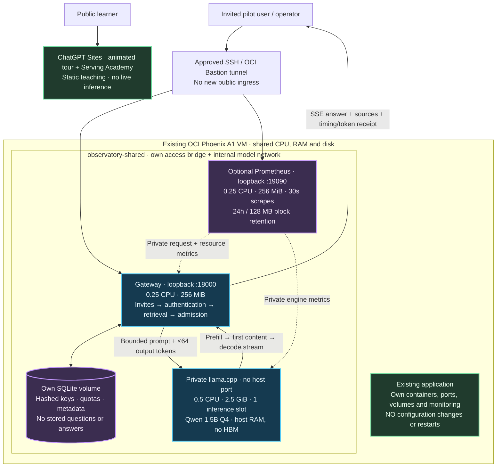

# Phoenix shared-host assistant

This is the **recommended first OCI pilot for an already-used A1 VM**, not a second VM or the full observability stack. It adds an invite-only real CPU assistant beside the existing application, with independent containers, storage and private networking. The public [Serving Academy](https://llm-serving-observatory.siva-babu.chatgpt.site/learn/) stays on Sites.

**Status: deployed as a private Phoenix A1 ARM64 pilot on 2026-09-08.** See [actual OCI receipts, host observations and limitations](../reports/oci-private-pilot.md). Local tests and GitHub runner checks remain separate from Phoenix measurements. A fresh capacity check and explicit deployment approval are still required for a new installation; the commands below are not a request to reinstall an existing pilot. Do not run `scripts/deploy.sh`, Terraform, cloud-init or the full Compose overlays on that existing Oracle Linux 9 host.

## Architecture and request flow



The model joins only the internal `backend` network. Gateway and Prometheus also join this project's own ordinary `access` bridge so Docker can publish their loopback ports; publishing from an internal-only network did not work in the Linux CI test. This bridge permits outbound connectivity from those two containers; it is **not** an egress firewall. Neither network connects to the incumbent application's Docker network, volumes, credentials, Grafana or collector. Isolation is not dedicated hardware: CPU caches, memory bandwidth, disk I/O and the Linux kernel are still shared. Resource limits reduce interference; they do not prove it cannot happen.

| Container | CPU ceiling | RAM ceiling | Exposure / role |
|---|---:|---:|---|
| Gateway | 0.25 logical CPU | 256 MiB | `127.0.0.1:18000`; one worker, at most 16 concurrent HTTP connections |
| Model | 0.5 logical CPU | 2,560 MiB | Internal `model:8080`; one inference slot and one compute/batch thread |
| Prometheus, optional | 0.25 logical CPU | 256 MiB | `127.0.0.1:19090`; own time series only |
| Total without / with metrics | 0.75 / 1.0 CPU | 2.75 / 3.0 GiB | Ceilings, not reservations or measured usage |

All three have read-only root filesystems, dropped capabilities, bounded temporary filesystems, 64-PID limits, 5 MiB × 2 rotated logs, and no extra container swap allowance. Restart-on-failure is limited to three consecutive failed restarts; it is not an unlimited self-recovery mechanism. Docker's restart-policy semantics still apply. No privileged containers, sensitive host-directory mounts, Docker socket, GPU, public proxy, automatic updates or new compute/storage resources are added. `:Z` labels apply only to this checkout's dedicated model/config bind mounts for SELinux; never point these mounts at another project's files.

The model uses the same pinned image and checksum-verified 1.12 GB GGUF as the full CPU profile. Context is 4,096 tokens. The gateway uses a conservative UTF-8-byte reservation, **not measured input tokenization**. Actual usage is reconciled from engine-reported tokens. Outputs default to and are capped at **64 tokens**, with a 90-second generation deadline and 100,000 estimated/reconciled tokens per UTC calendar month across users. Per-user daily quotas still apply. Failed, cancelled and unknown-usage work retains its reservation. A second simultaneous AI answer gets 429, not an unbounded queue.

The lab and benchmark routes are not registered in assistant-only mode, including the OpenAI-compatible **lab** endpoint `/v1/chat/completions`. They return 404 even if the caller knows a lab key. No lab database or simulated worker client is initialized. `/` keeps the explanatory animated tour; lab links there are unavailable in this profile. Use the public academy for exercises and `/assistant` for the pilot. The default full lab remains unchanged.

## 1. Gate the installation — no changes yet

Prerequisites: the existing Oracle Linux 9 ARM host, working Docker Engine with Compose v2-compatible commands and cgroup v2, Python 3.9+ for the standalone operator scripts, a **newly approved** Bastion/SSH session with the existing restricted allowlist, and permission to install this isolated application. The application still runs in its Python 3.12 container; do not install it into the host's older Python. A past read-only tunnel approval is not deployment approval. Use the console-generated tunnel command and the existing local private key; do not copy keys into the repository, disable host-key checking or open public SSH.

Run in a fresh, dedicated checkout of this repository on the target host, not inside the incumbent application's checkout. Review and use a known Git commit. First confirm Python, then run the non-mutating checker:

```bash
python3 -c 'import sys; assert sys.version_info >= (3, 9), "Python 3.9+ required for operator scripts"'
python3 scripts/shared_preflight.py
docker stats --no-stream
docker system df
df -h .
```

The checker requires at least 5 GiB `MemAvailable`, 8 GiB free on **both** the checkout and Docker data filesystems, no swap currently used, at least two CPUs, one-minute load no higher than 75% of logical CPU count, supported resource controls, unused ports 18000/19090 and no existing `observatory-shared` containers. It fails closed on missing tools/permissions. If Docker's data directory requires elevated read permission, review the script and run it with the host's approved administrative access; do not change directory permissions to make the check pass.

On this Oracle Linux host, Docker requires existing administrative access. Prefix Docker commands with `sudo -n`, and run checks that call Docker as `sudo -n python3 scripts/shared_preflight.py` or `sudo -n python3 scripts/check_shared_runtime.py`. For the canary, preserve only its required Compose selection: `sudo -n env COMPOSE_FILE=compose.shared.yaml python3 scripts/smoke_assistant.py --url http://127.0.0.1:18000`. The downloader should run as the checkout owner, not root. Do not change Docker socket permissions or add users to privileged groups for this deployment.

These are conservative **pilot gates, not a capacity model or an automatic go decision**. Load average is not CPU utilization. Compare at least 15 minutes of the incumbent's CPU, latency, error rate and container restarts before and during the pilot. Investigate unexplained restarts first. Never resize disks, prune images/build cache, stop the incumbent, increase quotas, or upgrade the cloud account just to satisfy a gate. A 100 GB boot volume does not mean its root filesystem has 100 GB available.

The September 8 read-only audit found an already-used 2 OCPU / 12 GB Phoenix A1 host running another application. Its database had material CPU demand and the root filesystem had much less free space than the boot-volume size suggested. That motivated this profile; those observations are **not current admission evidence**. No tenant identifiers, addresses or access keys are required in this public runbook. Check the account's aggregate free eligibility in the console; regional service quota is not a Free Tier allowance, and budget alerts do not cap spend.

## 2. Stage and start — only after approval

Run these commands **only in the dedicated checkout**. Explicitly select this single Compose file every time. Never append `compose.yaml`, `compose.cpu.yaml`, `compose.observability.yaml` or `compose.public.yaml`: merging them can reintroduce the full stack, ports and unbounded lab work. Do not override the project name or connect external networks.

```bash
python3 scripts/download_model.py
docker compose -f compose.shared.yaml --profile metrics config --quiet
docker compose -f compose.shared.yaml --profile metrics pull model prometheus
docker compose -f compose.shared.yaml build gateway
```

Pulling/building is **not** a runtime-limited operation; Docker build and download I/O can still affect the incumbent. Stage during an approved quiet period. Recheck free disk, memory and incumbent health after staging. Keep at least **4 GiB disk free** on both filesystems before starting. If the image/model footprint violates this floor, stop; do not reclaim someone else's data or assume Prometheus retention fixes disk pressure.

```bash
docker compose -f compose.shared.yaml --profile metrics up -d --wait --wait-timeout 660
docker compose -f compose.shared.yaml --profile metrics ps
python3 scripts/check_shared_runtime.py
```

The runtime checker reads actual Docker limits, health, restart/OOM state, loopback ports, assistant caps, disabled lab routes, unauthenticated-answer rejection, and both Prometheus scrape targets. It issues **no model request**. It requires the optional metrics service. If intentionally omitting metrics, use `docker compose -f compose.shared.yaml up ...` and manually inspect the two running containers; do not claim the three-container checker passed.

Health is layered: `/healthz` means the **gateway process** is alive, `/api/service/status` says inference is **configured**, model `/health` verifies the engine, and an authenticated smoke answer verifies the full path. Configuration alone is not model readiness. Do not remove a failing health check to make startup appear successful.

## 3. Invite-only canary and private access

Using the approved SSH/Bastion route, forward the VM's `127.0.0.1:18000` and optionally `127.0.0.1:19090` to laptop loopback ports. Visit `http://127.0.0.1:18000/assistant`. Do not change OCI NSGs, firewall rules or public routing in this stage.

Create a deliberately small one-day invitation on the VM:

```bash
docker compose -f compose.shared.yaml exec -T gateway python -m observatory.admin invite --requests 3 --tokens 12000 --hours 24
```

Deliver the invitation privately. Redeem it and retain the personal key securely. The browser holds the key in page memory; do not save it in screenshots, public logs or source control. Start with one short question. For an automated canary **that creates a temporary identity and invokes real inference**, explicitly approve that traffic, then run:

```bash
COMPOSE_FILE=compose.shared.yaml python3 scripts/smoke_assistant.py --url http://127.0.0.1:18000
```

It requests 64 output tokens, records timing/token metadata without the question or answer, and revokes its temporary key. This is not a load test. Keep real receipt measurements separate from the academy's simulated exercises and the existing x86 GitHub-runner receipt.

## 4. Observability with a small footprint

The native **`/observability`** page now displays a bounded metric catalog/charts, target health, alert states, gateway resources, per-request timelines and sanitized application events. Ordinary keys see personal metadata only; global data requires an explicit host CLI operator grant. It reuses the two existing data stores, adds no container and makes no model calls. Follow the [dashboard field guide](observability-dashboard.md) for access, architecture, retention, limits and absent instrumentation. Prometheus's own UI remains optional/private.

Open private Prometheus through the tunnel. It scrapes only this gateway and model every 30 seconds; there is no Grafana, Tempo, OTel collector, Alertmanager or node exporter in this profile. The three alert rules appear in the Prometheus UI, but **do not send email or paging notifications**. Stopping Prometheus also stops these checks. A separate external monitor would require a later design and approval.

| Question | Signal | Interpretation / boundary |
|---|---|---|
| How long before output? | `assistant_ttft_seconds`, per-request receipt | Retrieval start after authentication → first visible model content; excludes browser network time |
| How long to finish? | `assistant_request_seconds`, terminal status | Actual request duration including timeouts/cancellation |
| Is streaming smooth? | `assistant_chunk_gap_seconds` | Content-chunk gaps, **not** exact per-token ITL or decode TPOT |
| How many tokens? | `assistant_tokens_total{kind=...}`, receipt | Input/output/total plus optional cached and reasoning subsets; unknown stays null in receipts, not fabricated zeros |
| Why was work rejected? | `assistant_admission_denied_total{reason=...}` | Capacity, quota and output-cap denials; no unbounded user/prompt labels |
| Is the gateway consuming RAM/CPU? | `lab_resource_process_*`, `lab_resource_cgroup_namespace_root_*` | Historical metric prefix; real gateway process/container readings, not simulated load or model memory |
| What about model memory and throttling? | `docker stats`, `docker inspect`; model cgroup `memory.events`, `cpu.stat` during an approved diagnostic | Model cgroup usage includes charged file pages; not just RSS. Gateway cgroup metrics do not describe the model |
| Is prefill/decode/KV active? | Private `shared-model` scrape | Only metrics actually emitted by the pinned llama.cpp build; inspect names/units in its `/metrics` HELP lines. No HBM/GPU/KV-transfer samples |
| Did the incumbent suffer? | Its existing latency/error/resource dashboards; host `MemAvailable`, swap, disk | Do not reuse or alter its collector. There is no automatic cross-project health comparison here |

Example private PromQL:

```promql
histogram_quantile(0.95, sum by (le) (rate(assistant_ttft_seconds_bucket[10m])))
sum(rate(assistant_tokens_total{kind="output"}[10m]))
sum(increase(assistant_requests_total{status=~"error|timeout"}[10m]))
lab_resource_cgroup_namespace_root_memory_current_bytes
```

At very low traffic, percentiles/rates can be absent or unstable; inspect individual receipts and sample counts. Prefill and decode are real but **combined on one CPU engine**. KV is in host RAM; real remote KV transfer, disaggregated GPU serving, HBM bandwidth and GPU utilization are not measured here. No trace exporter is configured: a trace ID may appear in a receipt, but there is no persisted trace waterfall in this profile. Use the full isolated lab for that learning experience.

Prometheus deletes older blocks at 24 hours or the 128 MB block-retention target. **That is not a hard total disk cap**: WAL, head chunks, compaction, Docker images/logs and SQLite require additional space. Keep at least 4 GiB disk and 2 GiB available host RAM during the pilot. Readings below either floor, any OOM/unexplained restart, sustained swapping, repeated model deadlines or material incumbent latency/error regression are stop conditions. These operational stop conditions require a human; they are not automated remediation claims.

## 5. Pause, back up, recover

For a planned pause, let the active answer finish (maximum configured generation deadline 90 seconds). In an emergency, stop this project's model immediately; an in-flight answer may fail and retain its reservation. Neither command targets another project:

```bash
docker compose -f compose.shared.yaml stop model
SHARED_ENABLE_CPU=false docker compose -f compose.shared.yaml up -d --no-deps gateway
```

Search, authentication and retained history stay available; AI answers return 503. The model-down alert is expected in this mode. Remember to keep `SHARED_ENABLE_CPU=false` on future gateway recreations while paused. To resume, recheck incumbent health and capacity, start and wait for the model, then restore the gateway:

```bash
docker compose -f compose.shared.yaml up -d --wait --wait-timeout 660 model
SHARED_ENABLE_CPU=true docker compose -f compose.shared.yaml up -d --no-deps gateway
```

Create an online SQLite backup to a **new** filename (the CLI refuses overwrite):

```bash
docker compose -f compose.shared.yaml exec -T gateway python -m observatory.admin backup /app/data/assistant-backup-pilot-01.sqlite
```

Treat backup contents as credential material; export securely to approved private storage using the [main backup runbook](servingops-runbook.md#operator-runbook). No automatic OCI bucket upload is configured. A backup in the same volume does not survive loss of that volume or VM.

To stop the entire added stack while preserving its state:

```bash
docker compose -f compose.shared.yaml --profile metrics stop
```

Do not use `down -v`, Docker system prune, broad process kills, or the incumbent's service-control commands. The runtime check expects no prior restarts; investigate any recorded restart before accepting the pilot. `on-failure:3` also means operator verification/start is required after a Docker daemon or host restart; this beta does not promise unattended recovery.

## 6. Upgrade the private dashboard

This is an upgrade of an approved existing pilot, not permission to reinstall it. Do not rerun the new-install preflight against an active stack: it intentionally rejects occupied ports/existing containers. Instead, inspect current available RAM, disk, swap, incumbent health/restarts and this project's enforced limits. Investigate unhealthy/restarting services or less than 2 GiB available RAM / 4 GiB disk; builds are not constrained by runtime container limits. Preserve the incumbent and model/Prometheus containers.

1. Record the old gateway image ID and checkout commit. Wait for any active answer to finish; the dashboard upgrade briefly interrupts the gateway.
2. Run the online backup command above with a new dated filename **before** recreating the gateway. Do not overwrite a prior backup.
3. Fetch/review the exact tested revision in this project's dedicated checkout. Preserve any local changes and pause if they overlap.
4. Build only the gateway, then recreate only that service:

```bash
sudo -n docker compose -f compose.shared.yaml build gateway
sudo -n docker compose -f compose.shared.yaml up -d --no-deps --wait gateway
sudo -n python3 scripts/check_shared_runtime.py
sudo -n env COMPOSE_FILE=compose.shared.yaml COMPOSE_PROFILES=metrics \
  python3 scripts/smoke_dashboard.py --url http://127.0.0.1:18000
```

5. Compare incumbent health, latency, available RAM/disk/swap and restart counters before/after. Verify gateway/model/Prometheus health, private ports, limits, no OOM/restarts and actual metric freshness. A temporary dashboard smoke role/key must be revoked. Do not generate load to prove a dashboard works.

Rollback by restoring the recorded gateway code/image and recreating **only gateway** after preserving evidence. The new tables are additive; the previous application ignores them, so do not replace the live database just to roll back the UI. A DB restore is a separate recovery action that can lose newer quotas/history/keys and needs a deliberate maintenance plan. Never run `down -v`, delete volumes, prune images broadly or restart the incumbent. Keep the pre-upgrade image/backup until verification is complete. See [dashboard schema and privacy](observability-dashboard.md#privacy-deletion-and-storage).

## Evidence and next release

The [corrected integration run](https://github.com/sivalinb/llm-serving-observatory/actions/runs/34270910559) passed all four jobs, including full and shared real inference. Its [shared-profile receipt](../reports/shared-cpu-smoke.json) recorded **274 input / 64 output tokens, 17.60 s TTFT and 26.11 s total**, with the model limited to half a CPU and 2.5 GiB RAM. This is one x86 GitHub-runner request, **not** an OCI/ARM result, throughput benchmark or service-level promise. It hit the output cap, so the answer may be incomplete. Runtime checks also verified actual limits, healthy containers without restarts, network memberships, host-facing auth/lab boundaries and both metrics targets.

The later [OCI pilot record](../reports/oci-private-pilot.md) uses deployed code `800842e05e409259ed5733ecdff34851daa6edde`, whose [four CI jobs also passed](https://github.com/sivalinb/llm-serving-observatory/actions/runs/34273067398). Real ARM requests measured 31.27 s first-request TTFT and 0.24–0.25 s for two identical warm prefixes, each capped at 64 output tokens. That difference demonstrates measured prefix reuse, not general subsecond chat performance. All responses were length-limited and two lacked citations. The report keeps actual receipts, engine-work accounting, resource evidence and host observations separate from simulation and CI.

Record the reviewed commit, image/model pins, OCI shape/region (without secrets), before/after incumbent health, actual enforced resource limits, one cold and several sequential warm receipts, failures, RSS/cgroup memory, disk headroom and recovery outcome. Keep the pilot small; do not extrapolate one request into a throughput or availability claim.

Only after the private pilot passes should a separate change introduce a chosen domain, HTTPS, edge rate limiting, abuse controls and an allowlisted assistant route. Do **not** append the existing public overlay to this standalone profile. Until that work is reviewed, the Sites academy remains public and real inference remains private/invited. No new cloud capacity, paid inference, public SSH or modification of the incumbent is implied by this profile.

References: [Docker resource and service controls](https://docs.docker.com/reference/compose-file/services/), [Docker restart policy semantics](https://docs.docker.com/engine/containers/start-containers-automatically/), [Prometheus storage and retention](https://prometheus.io/docs/prometheus/latest/storage/), [OCI Always Free resources](https://docs.oracle.com/en-us/iaas/Content/FreeTier/freetier_topic-Always_Free_Resources.htm).
