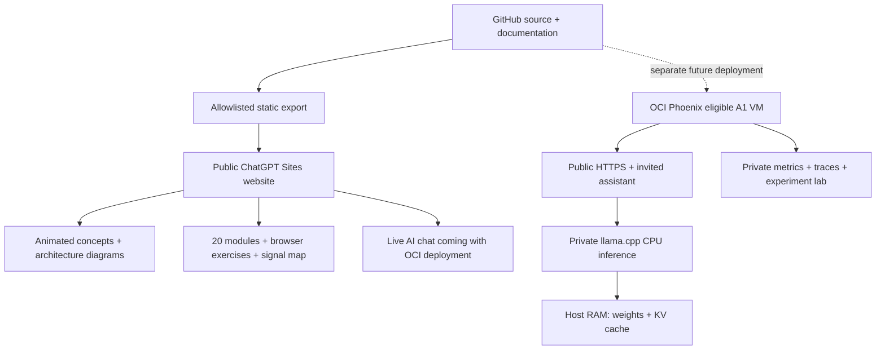

# Public portfolio now, OCI service later

Portfolio URL: https://llm-serving-observatory.siva-babu.chatgpt.site

This is a public **ChatGPT Sites** publication of the learning portfolio, not a public chatbot. The visitor does not need an application invite to read it. Hosting does not supply a ChatGPT model or run the repository's Python/llama.cpp service. Sites plan limits and access policies still apply; this is not an unlimited-free-hosting promise.

## What runs where

| Surface | ChatGPT Sites portfolio | Full local / future OCI service |
|---|---|---|
| Animated request journey | Yes; combined/disaggregated explanatory modes | Yes |
| Serving Academy `/learn/` | 20 modules, self-checks, four browser exercises and signal map | Static export can be hosted separately; not a FastAPI route |
| TTFT, tokens, CPU/RAM, GPU/HBM concepts | Read-only explanations and diagrams | Explanations plus private analytical lab |
| Four architecture diagrams | Public full-size SVGs | Public assets plus application views |
| Documentation assistant | Explicitly marked coming with OCI | Search; real CPU streaming when configured |
| Invites, keys, history and quotas | Not packaged; no application data collected | Private identity and admission ledger |
| Live metrics and traces | None; animation is not measured traffic | Private Prometheus/Grafana/Tempo |
| Private experiment lab and detailed hardware planner | Not packaged; separate simplified academy exercises are public | Local or SSH-tunneled `/lab` |



There is **no network connection from this portfolio to OCI or a model API**. We do not report browser animation timings as TTFT, invent a live token ledger, or expose operator dashboards to make the static publication look active. Platform-level hosting logs are separate from application telemetry; this export installs no analytics tracker and makes no model/API requests.

## Build and validate

Python 3.11+ is sufficient for the export; no additional packages are required:

```bash
python scripts/build_portfolio.py
python -m http.server 8766 --bind 127.0.0.1 --directory dist
```

The script reuses `observatory/static/home.html`, its animation and styles. It adapts only the exported copy: service calls-to-action become truthful deployment notices, lab bookmarks no longer redirect to an unavailable API, and the diagram gallery is added. The original FastAPI pages and full functionality are preserved.

`dist/` is ignored by Git. The output is limited to `index.html`, `404.html`, `learn/index.html`, homepage/portfolio/academy scripts and styles, the icon and four diagrams. The reviewed curriculum is compiled into HTML, not fetched from a server. Unexpected output files and symlinks fail the build rather than being published. Exact copy-replacement checks fail when the homepage changes incompatibly. Update the export and tests together in that case; do not weaken these checks to hide an error.

```bash
pytest -q
node --test tests/home-tour.test.cjs
node --test tests/academy.test.cjs
python scripts/build_portfolio.py
```

CI validates the export and existing service independently. The tests check available links/anchors/assets, explicit unavailable-service copy, deterministic output, asset allowlisting, no inference requests in the tour and protection against stale private files. They do not establish browser rendering quality or OCI performance.

## Publish an update

1. Reuse the exact project ID in `.openai/hosting.json`; do not create a second Site. The manifest declares only the Site binding and `static.directory: dist`.
2. Validate and commit the source; sync GitHub. Keep `.env`, data, models, credentials and build output out of source control.
3. With the Sites connector, obtain a short-lived write credential for this Site and push the exact validated source to its configured source branch. Authenticate per command; never save the token in files, remotes or Git configuration.
4. Package `dist/` with the Sites hosting helper, including the manifest. Save a version using the full SHA returned by `git rev-parse --verify HEAD` after the source push succeeds. The archive and pushed source must match.
5. Inspect the Site's current access, preserve the requested public audience, deploy the saved version and wait for a terminal success result. Verify the deployed URL without credentials before reporting it as live.

A GitHub commit is **not** a Sites deployment. A saved Sites version is also **not** a deployment. Track each publication's saved version and source SHA through the Sites interface. Roll back by deploying a previously validated saved version, retaining the intended public access. Any later source change needs a new validated publication.

## Move to OCI

Follow [the Phoenix runbook](servingops-runbook.md) and [OCI setup](oci-deployment.md). Verify PHX home-region eligibility, A1 availability, account allocations and expected costs before provisioning. OCI is a separate deployment; no VM is created by the Sites workflow.

Keep the portfolio until the real service has passed authentication, quota, streaming, health, HTTPS and private-telemetry checks. Then deliberately replace the pending-service links with the verified public OCI assistant URL and publish a new version. Do not expose `/lab`, metrics, keys or llama.cpp directly. Cross-origin API proxying and anonymous public inference are not implemented by this export.

Reference: [Official ChatGPT Sites documentation](https://learn.chatgpt.com/docs/sites).
