# Phoenix private pilot — actual ARM evidence

**2026-09-08 UTC · private pilot deployed and checked.** Real answers, enforced limits, private metrics and the 15-minute before/during comparison passed their stated checks. This is real CPU inference on the existing shared OCI VM, not the public academy's simulation or the earlier GitHub x86 runner. See the [operator runbook](../docs/oci-shared-host.md) and [machine-readable receipts, samples and counters](oci-private-pilot.json).

## Deployment boundary

- Reviewed and deployed code: `800842e05e409259ed5733ecdff34851daa6edde`. [CI run 34273067398](https://github.com/sivalinb/llm-serving-observatory/actions/runs/34273067398) passed all four jobs (tests, Terraform validation, full CPU inference, shared CPU inference). Two host-compatibility fixes added regression tests: Python 3.9-compatible streamed checksums and Docker JSON's `CpuCfsQuota` capability key. All 85 Python tests passed locally.
- Existing `us-phoenix-1` A1 Flex VM: 2 OCPU / 12 GB configured, Oracle Linux 9.8 ARM64, Python 3.9.25, Docker 29.8.0, Compose 5.5.1, cgroup v2, SELinux enforcing. The application runs in its own Python 3.12 container.
- Only `compose.shared.yaml --profile metrics`: independent gateway, llama.cpp and Prometheus; own volumes/networks; loopback ports 18000/19090. Model has no host port. Runtime inspection verified ARM64 images, actual CPU/RAM/swap limits, healthy containers, read-only roots and 64-PID limits. Model is internal-network-only; gateway/Prometheus also use their own ordinary access bridge, not an egress firewall.
- No new VM, disk, paid inference, public endpoint, manual firewall/NSG policy change, host upgrade, Docker privilege change, or change to the incumbent application's configuration. Docker created only this project's normal bridge/publishing rules. Access used short-lived Bastion sessions with the existing key and restricted allowlist. GitHub documentation is public; addresses, tenant IDs, access credentials, questions and answers are omitted from this evidence.
- The [public academy](https://llm-serving-observatory.siva-babu.chatgpt.site/learn/) was **not republished or connected to this backend**. Its pending-public-chat notice remains. This pilot is private/invite-only, not a public ChatGPT replacement or an HA service. Existing resources and a Free Tier account are not a zero-cost guarantee.

```mermaid
flowchart LR
  B["15-minute baseline<br/>Existing service only"] --> G["Fresh capacity gate<br/>No swap · RAM/disk headroom"]
  G --> S["Verified model + ARM images<br/>Build · wait for staging load to settle"]
  S --> R["Private runtime checks<br/>Limits · auth · networks · scrape targets"]
  R --> C["Three sequential real answers<br/>First request + two identical warm requests"]
  C --> O["15-minute pilot observation<br/>Incumbent probes + host resources"]
  O --> H["Private handoff<br/>Evidence · backup · operating limits"]
  classDef gate fill:#173b32,color:#e6fff4,stroke:#65d8a5,stroke-width:2px;
  classDef run fill:#163b53,color:#e7f7ff,stroke:#5cc9f5,stroke-width:2px;
  classDef proof fill:#3d2f54,color:#f6edff,stroke:#c69bf3,stroke-width:2px;
  class B,G gate;
  class S,R,C run;
  class O,H proof;
```

## Real answer receipts

All three use the same approved-documentation question, one at a time, with a new temporary identity revoked after each test. The model is Qwen2.5-1.5B-Instruct Q4_K_M, one inference slot, one compute thread, 4,096-token context, a **0.5 logical-CPU ceiling / 2.5 GiB RAM ceiling**, and 64 output tokens. “First request” means first inference after engine startup; it is **not** a controlled cold-disk/page-cache benchmark.

| Request | Input | Cached input subset | Output | First content (TTFT) | Total duration | Citation check |
|---|---:|---:|---:|---:|---:|---|
| First after startup | 274 | 0 | 64 | 31.268 s | 48.365 s | Source ID present |
| Identical warm request 1 | 274 | 273 | 64 | 0.250 s | 17.236 s | Missing |
| Identical warm request 2 | 274 | 273 | 64 | 0.239 s | 17.187 s | Missing |

These passed **transport, authenticated real inference, nonempty streaming and usage checks**, not an answer-quality evaluation. Every answer ended with `finish_reason=length`: truncation is a real limitation. Citation presence only checks source IDs, not factual support. Two answers lacked citations. The 64-token pilot is suitable for a short mechanics demonstration and linked document search, not trustworthy long-form answers. Increasing output, CPU or concurrency is a separate capacity/quality decision.

TTFT is measured by the gateway after authentication, from question processing/retrieval start to first model content; it excludes the user's browser/network delay. Total duration is gateway request duration. Warm requests reuse an identical prefix: do not advertise their subsecond TTFT as typical performance for new questions, independent tenants or longer prompts. There is no concurrent-traffic, saturation, GPU or SLA result here.

### Token accounting that reconciles across layers

The three receipts total **822 input + 192 output = 1,014 total tokens**. Cached input is **546 of those 822 input tokens**, not 546 extra tokens. Uncached input is 276. The engine's post-canary `llamacpp:prompt_tokens_total` was **276**, matching newly processed prompt tokens rather than the gateway's full input-token total. Its generated-token counter was 192. This is the distinction between request usage and engine work.

The initial conservative quota reservation was 1,687 estimated tokens per request, reconciled to 338 actual total tokens for each successful request. That reservation is not tokenizer output. Reasoning and visible-output subsets were **unknown (`null`)**, not zero; do not invent “extended tokens” or add unknown subsets to totals. Prefix reuse is engine-local RAM reuse, not a remote KV transfer measurement. The shared engine's cache is not a per-tenant cache-security guarantee; this private teaching pilot uses a curated, nonprivate corpus and has no private document uploads.

## Resource and observability evidence

After the three canaries (20:39:01 UTC):

| Container | Enforced CPU ceiling | Enforced RAM ceiling | Observed cgroup memory | Swap / OOM / restarts |
|---|---:|---:|---:|---|
| Gateway | 0.25 core | 256 MiB | 52.46 MiB | 0 / 0 / 0 |
| Model | 0.50 core | 2,560 MiB | 1,559.48 MiB | 0 / 0 / 0 |
| Prometheus | 0.25 core | 256 MiB | 45.98 MiB | 0 / 0 / 0 |

These are point-in-time `memory.current` readings, **not peak RSS, per-request attribution or GPU VRAM**. Cgroup memory includes charged file pages such as memory-mapped weights. Ceilings sum to 1 CPU / 3 GiB, but are not reservations. The model's `cpu.max` was `50000 100000`: 50 ms CPU time per 100 ms period, not 50% of the two-core host. Its lifetime counters at that snapshot showed 894 throttled periods of 1,028 periods and 38.57 seconds throttled time. Cumulative cgroup counters are not added to request latency; throttling is expected under this deliberately low ceiling.

Both private Prometheus targets were `up`, and all three configured alert rules were loaded. There is no notification receiver, node exporter, Grafana or persisted trace backend in this slim profile. A receipt trace ID is correlation metadata, not proof of an exported trace.

Observed engine families include `llamacpp:prompt_tokens_total`, `prompt_seconds_total`, `tokens_predicted_total`, `tokens_predicted_seconds_total`, `prompt_tokens_seconds`, `predicted_tokens_seconds`, `requests_processing` and `requests_deferred`. After the canaries, engine prompt time totaled 31.694 s and prediction time 51.026 s; reported generation throughput was 3.763 tokens/s. These engine counters are distinct from gateway end-to-end timing and do not establish capacity under load. This build did **not** expose a KV-byte/occupancy gauge in the inspected metrics, and there were no GPU/HBM or remote KV-transfer samples. Absent measurements remain absent.

## Before/during host comparison

The baseline ran **20:08:46–20:23:46 UTC**, 31 samples at 30-second spacing, before model download/container startup. The completed pilot observation ran **20:35:15–20:50:15 UTC**. Each window gives 30 CPU intervals and 31 read-only HTTP health and recent-telemetry query probes against the incumbent application on VM loopback. Both observers exited successfully with no stop condition. Runtime checks were repeated near the end; all three pilot containers remained healthy at every observation sample.

The incumbent's telemetry payload contains simulated sensor data; only freshness/sample count was inspected. The measured HTTP probe latency is real database/API response time, **not customer-request latency or an existing production SLO**. CPU uses deltas from the first eight `/proc/stat` CPU counters, treating idle+iowait as idle and not double-counting guest time. RAM is host `MemAvailable`, not container RSS.

| Signal | Baseline | Pilot |
|---|---:|---:|
| Mean host CPU (whole host) | 40.34% | 43.66% |
| Minimum available host RAM | 6.94 GiB | 5.69 GiB |
| Minimum free Docker-filesystem space | 10.21 GiB | 8.83 GiB |
| Health probe mean / max | 7.32 / 12.60 ms | 7.53 / 13.92 ms |
| Telemetry-query mean / max | 25.56 / 43.97 ms | 30.59 / 75.58 ms |
| Swap used | 0 | 0 |
| New incumbent restarts / OOMs / probe failures | 0 / 0 / 0 | 0 / 0 / 0 |

The telemetry-query mean increased by **5.04 ms (19.7%)**, and one probe during the first inference reached 75.58 ms. This is not a zero-interference result. There was no sustained probe failure or health deterioration in this small window, but no customer SLO or sustained-load acceptance threshold was tested. Host CPU peaked at 66.78% during inference versus 52.53% in the baseline. The pilot stayed above the 2 GiB RAM / 4 GiB disk floors with no swap. Latest telemetry samples remained at most 36.12 seconds old during the pilot (38.28 seconds in baseline). This finite comparison supports a small supervised private pilot, not capacity or availability guarantees.

Staging was measured separately and excluded from both comparison windows: download/build is not covered by container runtime CPU limits. A post-build sample saw load 2.44, health/query probes 20.82/49.08 ms and 7.53 GiB free disk. We waited; the final pre-start gate passed again at load 1.37, 7.00 GiB available RAM, 8.96 GiB free disk and zero swap. No cache pruning, filesystem resizing or incumbent control operation was used to pass the gate. Changes in free disk also reflect ordinary activity on the shared host.

An incumbent collector already had nine historical restarts. That count stayed unchanged through the baseline; pre-pilot recent event checks found no restart/OOM events and the API continued receiving fresh samples. Report **restart deltas**, not a misleading claim that every existing container had a lifetime restart count of zero.

## Backup, recovery and access

A new online SQLite backup was created inside this pilot's own data volume and passed its integrity check. A separate read-only comparison verified three successful ledger rows in both live DB and backup, zero active canary keys, and mode `0600` on both files. It contains credential hashes and remains private; no database was uploaded to GitHub, Sites or the unrelated OCI bucket. A same-volume backup does **not** protect against volume/VM loss. Disaster recovery and off-host restore are not claimed. Search-only pause/resume is implemented and unit-tested, but was not exercised on this live host during this pilot; the model and gateway were not deliberately restarted after acceptance.

The assistant and Prometheus are accessible only through approved SSH/Bastion loopback forwarding. Access expires with the short-lived Bastion session; renew using the same approved target/key/allowlist. Do not open public SSH or inference to bypass expiration. The [runbook](../docs/oci-shared-host.md) includes bounded invitations, search-only pause/resume, scoped stop, backup handling and human stop conditions. No long-lived owner key is published here.

## Remaining release gates

- The finite observation is complete; repeat capacity/health checks before expanding traffic. This record is not a claim of unattended monitoring.
- Review small-model answer quality and the 64-token truncation tradeoff before expanding usage.
- Test capacity with an explicitly approved workload and protect the incumbent; three sequential requests do not justify more users or concurrency.
- Add and test approved off-host backup/restore, external alert delivery and restart recovery before availability claims.
- A public assistant requires a separate reviewed domain/TLS/edge-abuse design and deliberate public-site update. The public Compose overlay must not be merged into this shared profile.
